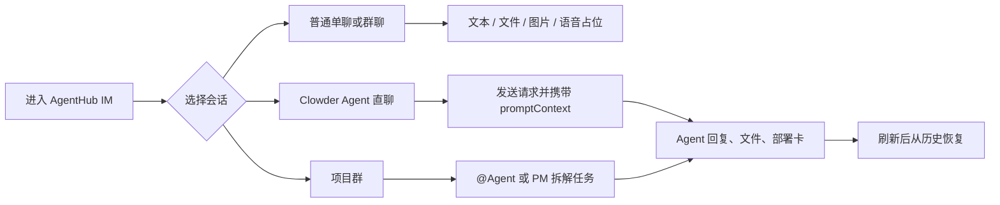
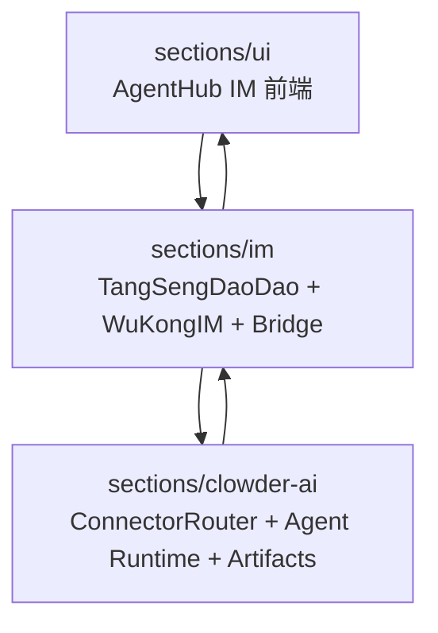

# AgentHub IM 与 Clowder 综合交付文档

> 版本：v1.0
> 日期：2026-06-10
> 合并来源：
> - [prd产品需求文档.md](./prd产品需求文档.md)
> - [薛定谔的队交付文档.md](./薛定谔的队交付文档.md)
> - 技术细节可继续参见 [技术文档.md](./技术文档.md)

## 1. 文档定位

本文面向产品评审、交付验收和后续研发排期，把 IM 侧 PRD 的用户价值、验收口径，与后端 Agent 交付文档中的路由、协调、A2A、产物、部署、预览、会话、安全和运维设计合并成一条完整主线。

本文优先回答四个问题：

1. AgentHub IM 为什么要把人、IM 和 Clowder 多智能体放进同一条消息流。
2. 当前阶段要交付哪些用户可见能力，以及什么不在本阶段承诺内。
3. 从用户消息到 Agent 回复、产物、部署和项目群，系统如何闭环。
4. 什么情况算交付完成，失败、权限、刷新、重连和跨端如何验收。

## 2. 产品一句话

AgentHub IM 把人和 Clowder 智能体放进同一条 IM 消息流。用户像聊天一样发消息、@ Agent、确认卡片、收文件、看部署结果；Clowder 在背后完成多 Agent 路由、协调、上下文管理、产物声明和交付闭环。

## 3. 背景与问题

### 3.1 用户侧问题

| 问题 | 现在的表现 | AgentHub IM 的答案 |
| --- | --- | --- |
| 多 Agent 切换成本高 | 用户需要在 Claude Code、Codex、OpenCode 等工具间搬运上下文 | 在 IM 中通过 @、focus、项目群和协调器把任务送到合适 Agent |
| 群聊协作难留痕 | 人和 Agent 的分工、回复、文件、部署动作散落在不同工具里 | Agent 回复、协作记录、文件卡、部署卡都落在当前会话 |
| 结果不稳定 | 流式回复、刷新、重连后可能出现重复气泡或丢失最终回复 | 用 `messageId`、`clientMsgNo`、`streamKey` 和 `platformMessageId` 合并 |
| 权限边界不清 | 群里谁能授权、谁能置顶、谁能触发 Agent 容易混在一起 | 群角色、白名单、管理员命令、IM pin 和 Clowder manual context pin 分层 |
| 交付物难检查 | 代码、文件、预览、部署请求和日志散在各处 | 文件卡、部署卡、项目群卡和 Agent 看板都指向源消息、thread 和产物 |

### 3.2 已有系统基础

| 区域 | 现有能力 | 本文中的角色 |
| --- | --- | --- |
| `sections/ui` | Vue/uni-app IM 工作台、移动聊天、智能体页、文件预览、Clowder 面板、部署卡、项目群卡、技能页 | 用户可见体验层 |
| `sections/im` | TangSengDaoDao 业务 API、WuKongIM 通讯、消息持久化、群组、文件、Clowder bridge | IM 消息和外部 bridge 层 |
| `sections/clowder-ai` | thread、Agent 注册、命令、技能、记忆、协调记录、Connector Router、出站投递、Agent CLI 适配 | 多智能体平台层 |

硬约束：

- 浏览器不保存 Clowder 密钥，签名、转发、默认 owner 都在后端配置。
- TangSeng/WuKongIM 是 IM 消息、会话、群组、文件和历史同步的权威来源。
- Clowder 是 Agent、thread、connector binding、命令、权限、协调和运行时调用的权威来源。
- IM 后端只做 bridge 和状态映射，不复制 Clowder 的路由逻辑。

## 4. 目标、非目标与优先级

### 4.1 本阶段目标

| 目标 | 说明 | 优先级 |
| --- | --- | --- |
| IM 基础稳定 | 单聊、群聊、会话列表、消息同步、文件/图片/语音占位可用 | P0 |
| Clowder 直聊 | 用户可把一个 Clowder Agent 当作联系人直接聊天 | P0 |
| 群聊 @ Agent | 群聊中 @ 单个或多个 Agent，消息进入对应 Clowder thread | P0 |
| 主 Agent 协调 | 复杂任务由 PM/协调者拆解、派发、聚合 | P0 |
| 流式回复合并 | Agent 的 placeholder、chunk、final 最终落成一条稳定回复 | P0 |
| 多 Agent 接入 | 至少接入 Claude Code、Codex 两类主流 Agent，架构预留 OpenCode、Gemini、Kimi、A2A Agent | P0/P1 |
| 技能与模板 | 用户可查看技能、添加技能、分配技能；缺失模板 Agent 可通过卡片补齐 | P1 |
| 项目群闭环 | PM 直聊中创建项目群，把用户、PM Agent 和执行 Agent 拉到同一协作空间 | P1 |
| 产物与部署 | 文件、源码包、预览、部署请求用卡片呈现，支持确认、取消、重试 | P1 |
| 跨端体验 | 桌面、平板、移动视口下主流程不遮挡、不横向溢出 | P1 |

### 4.2 暂不承诺

- 不把 Clowder 全部后台能力搬到 IM 前端。IM 只承接聊天里需要看到和操作的部分。
- 不承诺所有 rich blocks 都有专属组件。优先支持 Markdown、文件、媒体、部署卡、项目群卡、模板 Agent 卡；其他 rich blocks 先降级为可读文本或通用卡片。
- 不在浏览器里保存任何 Clowder connector secret、Agent API Key 或 provider OAuth secret。
- 不默认允许群聊 Agent 主动插话。除非有 @、命令、focus、授权规则或协调任务触发。
- 不自动执行高风险部署或容器化生产发布。容器计划可生成，自动执行需要后续安全审查。

## 5. 用户角色

| 角色 | 典型诉求 | 关注点 |
| --- | --- | --- |
| 普通协作用户 | 在聊天里问问题、发文件、查看结果 | 入口简单，回复不重复，失败能看懂 |
| 项目负责人 | 把一个想法拆成任务，跟踪多人和多 Agent 的进度 | 项目群、看板、协作记录、部署状态 |
| 执行开发者 | 让不同 Agent 做实现、审查、部署准备 | @ 路由准确，文件和日志可回溯 |
| 管理员 | 控制群里是否允许 Agent、哪些命令可用 | 白名单、角色快照、审计信息 |
| 平台维护者 | 接入新 Agent、排查 invocation、治理资源限制 | 适配器、回调认证、队列、指标和日志 |

## 6. 体验主线



典型闭环：

1. 用户在单聊、群聊、Clowder 直聊或项目群里发送消息。
2. UI 先乐观插入本地消息，生成 `clientMsgNo`，状态为 `sending`。
3. TangSeng/WuKongIM 持久化成功后，UI 合并为 `success` 并更新会话摘要。
4. Clowder bridge 将消息归一为 `InboundMessage`，带上 sender、externalChatId、mentions、promptContext 和角色快照。
5. Clowder `ConnectorRouter` 去重、鉴权、处理命令、查找 thread binding，并根据 @、focus、协调规则选择目标 Agent。
6. Agent 回复通过 `ImWebAdapter` 回写 TangSeng，流式回复用稳定 ID 合并成一条消息。
7. 如有产物、项目群、部署或预览，系统追加文件卡、部署卡、项目群卡或看板状态。
8. 用户刷新或重连后，IM 历史和 Clowder thread 信息可以恢复，不出现重复气泡。

## 7. 功能全景

### 7.1 IM 消息中心

Message Hub 是用户、Agent、群组和项目群之间的消息流转枢纽。

| 能力 | 产品表现 | 验收要点 |
| --- | --- | --- |
| 文本消息 | 输入后立即显示，成功后状态稳定 | `sending -> success`，失败保留并可重试 |
| 媒体和文件 | 图片、文件以卡片或预览入口展示 | 文件名、大小、下载、预览状态完整 |
| 群聊消息 | 头像、昵称、时间、@ 提醒可读 | 群成员多时不遮挡消息内容 |
| 引用回复 | 发送时带引用摘要，可跳转到原消息 | 切换会话时不残留旧引用 |
| Pin 消息 | 支持单聊/群聊置顶、取消置顶、清空置顶 | 群聊按群主、管理员或群配置校验 |
| Reaction/ACK | Agent 可对用户消息给出“已收到”反馈 | silent reaction 不产生空消息 |
| 历史恢复 | 刷新、重连后消息顺序和摘要正常 | 无重复气泡，无丢失最终回复 |
| 富媒体卡片 | 部署卡、项目群卡、模板 Agent 卡、文件卡 | source message、thread、metadata 可追溯 |

消息状态统一为：

| 类型 | 状态 |
| --- | --- |
| 用户消息 | `sending`、`success`、`failed`、`revoked`、`edited` |
| Agent 流式回复 | `placeholder`、`chunk`、`final`、`cleanup` |
| 产品态 | `queued`、`streaming`、`done`、`error`、`cancelled` |
| 调用态 | `created`、`running`、`done`、`error`、`cancelled` |

实现要求：

- 前端发送时先乐观插入本地消息，使用 `clientMsgNo` 做去重。
- 服务端返回的同一条消息必须通过 `messageId`、`clientMsgNo`、`streamKey` 合并，不新增重复气泡。
- Clowder streaming 的 `placeholder/chunk/final` 必须使用同一 `platformMessageId` 或稳定 `client_msg_no`。
- `cleanup` 且内容为空时返回 no-op，不生成空消息。
- 失败消息留在原位置，用户能看到失败原因并重试。

### 7.2 Clowder Agent 直聊

用户可以把一个 Clowder Agent 看成联系人，例如 `clowder_cat:coordinator` 或运行时创建的 Agent。直聊时，前端调用 `/v1/clowder/conversation/message`，后端先把用户消息持久化到 IM，再把归一化消息转给 Clowder。

验收标准：

- Agent 目录中的显示名、别名、能力标签不会退化为技术 ID。
- 用户消息发送成功后，近期文本进入本地 `promptContext` 缓存，用于下一次直聊补上下文。
- Agent 回复以 Markdown 渲染；流式更新只占一条消息。
- 失败时显示可理解失败态，不让用户误以为消息已被处理。

### 7.3 群聊 @ Agent

群聊里人和 Agent 一起工作，但 Agent 默认不主动插话。路由优先级：

1. 明确 @ 或 `directCatId`。
2. `targetCatIds` 或 `/ask` 指定目标。
3. 当前 thread 的 focus 或最近活跃 Agent。
4. 复杂任务或未指定目标时回到协调者。

验收标准：

- 用户在群聊中 @ 一个 Agent，只触发目标 Agent。
- 用户 @ 多个 Agent 或提出“拆解、协调、部署、规划”类任务时，协调者可生成协作记录。
- 群未授权时，Agent 不执行，并给出可见提示。
- 管理员命令和普通成员命令权限不同，拒绝原因明确。
- `InboundMessage` 包含 `sender`、`externalChatId`、`mentions`、`sourceRoleSnapshot`。

### 7.4 主 Agent 协调器

协调器的价值是把复杂任务拆成能执行、能检查、能聚合的步骤，而不是“多说几句”。

触发条件：

| 场景 | 行为 |
| --- | --- |
| 无 @ 提及 | Coordinator 自动作为 lead |
| 显式 @coordinator | Coordinator 作为 lead |
| @ 多个 Agent | Coordinator 作为 lead |
| 单 @ + 复杂任务关键词 | Coordinator 作为 lead |
| 单 @ + 简单任务 | 直接路由到该 Agent |

协调流程：

```text
用户输入
  -> 意图识别与任务拆解
  -> 生成 Coordination Plan
  -> 并行或串行分派给子 Agent
  -> 收集各 Agent 产出
  -> 冲突检测与结果聚合
  -> 在聊天流中汇报最终成果
```

协调状态：

```text
planning -> dispatching -> running -> aggregating -> succeeded
                    \-> failed / cancelled
```

子任务状态：

```text
todo -> doing -> done
  \-> blocked -> failed / cancelled
```

验收标准：

- 复杂任务词或多个目标 Agent 会触发 coordination 记录。
- 协调状态从 `planning` 开始，可在看板或右侧面板查看。
- 子任务能记录目标 Agent、状态、结果和 artifact refs。
- 汇总结果回到聊天消息流，文件和日志可以继续打开。

### 7.5 多 Agent 接入层

Agent 接入层通过统一 `AgentService` 和 Agent registry 屏蔽 provider 差异。当前至少稳定接入 Claude Code 和 Codex，架构上预留更多 provider。

| 平台 | clientId | 协议 | 说明 |
| --- | --- | --- | --- |
| Claude Code | `anthropic` | CLI + MCP | Anthropic 生态 |
| Codex | `openai` | CLI + MCP | OpenAI 生态 |
| Gemini | `google` | CLI + MCP | Google 生态预留 |
| Kimi | `kimi` | CLI + MCP | Moonshot 生态预留 |
| OpenCode | `opencode` | CLI + MCP | 开源生态预留 |
| A2A Agent | `a2a` | JSON-RPC 2.0 | 远程 Agent 协议预留 |

AgentProfile 采用 Identity + Runtime Profile 两层：

| 层级 | 字段 | 用途 |
| --- | --- | --- |
| Identity | `id`、`name`、`displayName`、`nickname`、`avatar`、`color`、`mentionPatterns`、`roleDescription` | UI 展示、@ 解析、角色说明 |
| Runtime Profile | `clientId`、`defaultModel`、`cli`、`accountRef`、`sessionStrategy`、`mcpSupport` | 调用 provider、账户隔离、会话策略和工具支持 |

用户自建 Agent 流程：

1. 设定名称、头像和 @ 别名。
2. 编写 System Prompt。
3. 选择底层平台与默认模型。
4. 绑定可用账户或运行时配置。
5. 保存后在聊天、群聊和项目群中可 @ 使用。

### 7.6 A2A Agent 间通信

A2A 允许 Agent 在执行过程中请求其他 Agent 继续处理，形成可控的工作链。

示例：

```text
用户 @Claude: 写一个 React 组件
  -> Claude 生成代码
  -> Claude 回复末尾: @Codex 请帮我写这个组件的单元测试
  -> 系统检测到 @Codex
  -> 触发 A2A handoff，将任务转交给 Codex
  -> Codex 带上下文开始写测试
```

防护机制：

| 机制 | 说明 |
| --- | --- |
| 深度限制 | A2A 链最大深度 15 层，防止无限递归 |
| Ping-pong 防护 | 同一对 Agent 来回超过阈值自动警告或阻断 |
| Anti-cascade | 若 Agent 已是活跃 multi-mention 目标，拒绝新级联请求 |
| 目标数限制 | 单次 A2A mention 最多 2 个目标 |
| 超时保护 | 每条 A2A 消息 3-20 分钟超时 |

### 7.7 项目群

项目群把 PM 直聊中的一个项目拉成独立群聊。后端 `ensureProjectGroup` 确保项目群存在，并把用户、PM Agent 和必要执行 Agent 放进群里。重复创建同名项目时优先复用 active binding。

验收标准：

- PM 直聊中能生成“创建项目群”确认卡。
- 确认后创建或复用项目群，群名、成员、项目 thread binding 正确。
- 项目群里能继续 @ Agent。
- 右侧 Clowder 面板能显示 project thread、workspace、focus 和 Agent 列表。
- 项目群入口能从会话列表和卡片回到对应群聊。

### 7.8 产物管理

Agent 的结果可能是代码、文档、图片、补丁、预览、源码包或工作区目录。产物需要统一声明、存储、展示和回溯。

| 类型 | 说明 | 展示方式 |
| --- | --- | --- |
| `code` | 代码文件 | 代码块 + 语法高亮 |
| `doc` | 文档 | Markdown 渲染 |
| `image` | 图片 | 直接展示 |
| `preview` | 可预览文件 | iframe 或预览入口 |
| `file` | 普通文件 | 文件卡和下载链接 |
| `patch` | 代码补丁 | Diff 视图 |
| `workspace` | 工作区目录 | 文件树 |

产物声明流程：

```text
Agent 生成文件
  -> 调用 agenthub_declare_artifact 声明产物
  -> 后端验证文件存在性和路径合法性
  -> 产物关联到 thread / task / source message
  -> 前端按 Agent 或任务分组展示
```

三层存储模型：

| 层级 | 用途 | 持久性 |
| --- | --- | --- |
| `runtime` | Agent 临时工作区 | 临时 |
| `userWorkspace` | 用户项目源码 | 持久 |
| `delivery` | 浏览器可访问媒体或交付物 | 持久 |

### 7.9 部署发布

部署让用户在聊天中直接确认部署、查看状态、打开预览或下载源码包。

部署流程：

```text
用户或 Agent 发起部署请求
  -> 系统解析部署目标
  -> 用户确认或取消
  -> 创建 DeploymentJob
  -> 执行静态站点部署 / 源码包生成 / 容器计划检测
  -> 返回部署状态卡片
```

| 类型 | 说明 | 优先级 |
| --- | --- | --- |
| 静态站点部署 | HTML 或静态目录生成预览 URL | P0 |
| 源码包下载 | 打包为 `.tar.gz` | P0 |
| 容器化部署 | 检测 Dockerfile，生成部署计划 | P1 |

验收标准：

- 部署卡必须带 `deploymentRequestId`、source message、target、environment。
- 确认、取消、重试走结构化接口，不降级成自然语言消息。
- 后端失败时卡片保留并显示失败原因。
- 敏感文件、`.env`、`.pem`、`.key`、`node_modules` 等不进入源码包或部署产物。

### 7.10 预览系统

预览支持 Agent 生成的网页、应用和静态产物在聊天工作区内打开。

| 能力 | 说明 | 优先级 |
| --- | --- | --- |
| iframe 预览 | 聊天流或右侧工作区内嵌预览 | P0 |
| 全屏预览 | 点击展开全屏 | P0 |
| 本地服务发现 | 自动发现本地 dev server 端口 | P1 |
| 反向代理 | 安全代理 localhost 服务 | P1 |
| HMR 热更新 | WebSocket 代理支持热更新 | P1 |
| 截图功能 | 预览页面一键截图 | P2 |

安全约束：

- 仅允许代理到 localhost / 127.0.0.1。
- 端口白名单并排除系统服务端口。
- 校验 Origin，禁止递归代理到网关自身。
- 剥离不适合 iframe 的 header 时需要保持最小改动。
- 防目录遍历攻击。

### 7.11 技能、模板与 Agent 目录

前端智能体页既展示静态 Agent，也同步 Clowder 目录和用户技能。

验收标准：

- Agent 列表能展示系统 Agent、用户创建 Agent 和 Clowder 运行时 Agent。
- 技能市场、我的技能、技能分配可用。
- 技能只能分配给当前用户可见的 Agent。
- 上传 zip 必须拒绝路径穿越和不安全文件名。
- 模板 Agent 使用 `cat-template.json`，创建后同步名称、别名、简介和能力标签。

### 7.12 右侧工作区与移动端退路

桌面端右侧工作区用于文件预览、Clowder 面板、项目上下文和部署状态。移动端切换为独立页面或覆盖层，不挤压聊天区。

验收标准：

- 1440px 桌面下，左侧导航、会话列表、聊天区、右侧工作区都能看清。
- 375px 移动端下，输入框、工具栏、发送按钮不遮挡消息。
- 长文件名、长群名、长 Agent 名不压住时间和状态。
- 暗色模式、通知提示、空态和错误态可读。

## 8. 架构与模块职责

### 8.1 三层边界



| 层级 | 主要职责 | 不该做的事 |
| --- | --- | --- |
| 前端 UI | 会话、消息、卡片、Agent 目录、技能、文件预览、移动适配 | 不保存 secret，不自己决定 Clowder 权限 |
| IM/Bridge | 登录、好友、群组、消息持久化、文件、WuKongIM 同步、Clowder inbound/outbound 签名转发 | 不复制 Clowder 路由，不替代 thread 权威 |
| Clowder | Agent registry、connector binding、命令、权限、thread、协调、A2A、产物、部署、出站投递 | 不替代 TangSeng/WuKongIM 的 IM 存储 |

### 8.2 源码职责索引

| 区域 | 主要文件 | 职责 |
| --- | --- | --- |
| 前端 API 聚合 | `sections/ui/services/native-im/service.js` | 登录、SDK 初始化、消息同步、Clowder API、技能、项目群、部署请求 |
| 前端消息状态 | `sections/ui/services/native-im/message-state.js` | 消息摘要、去重、流式合并、prompt context、reaction、pending feedback |
| 前端 Agent 状态 | `sections/ui/services/native-im/agent-state.js`、`sections/ui/stores/agent.js` | Agent 目录、直聊联系人、技能、角色模板、删除屏蔽 |
| 前端消息 Store | `sections/ui/stores/message.js` | 本地乐观插入、发送、同步、项目群卡、部署卡、模板 Agent 卡 |
| 前端聊天 UI | `sections/ui/components/chat/*.vue` | 消息气泡、输入区、文件卡、Clowder 面板、右侧工作区 |
| TangSeng bridge 配置 | `sections/im/TangSengDaoDaoServer/modules/common/clowder_config.go` | bridge 开关、Clowder API、secret、owner、超时 |
| TangSeng 签名 | `sections/im/TangSengDaoDaoServer/modules/common/clowder_signature.go` | HMAC SHA-256 签名与时间窗校验 |
| TangSeng Clowder 模块 | `sections/im/TangSengDaoDaoServer/modules/clowder/*.go` | API、inbound/outbound 归一化、项目群、技能、manual context pins、媒体 |
| IM 消息监听 | `sections/im/TangSengDaoDaoServer/modules/message/event.go` | 注册消息监听器，把 IM 消息转发到 Clowder |
| Clowder connector 类型 | `sections/clowder-ai/packages/shared/src/types/connector.ts` | `im-web` connector definition、thread binding 类型 |
| Clowder inbound | `sections/clowder-ai/packages/api/src/infrastructure/connectors/ImWebInboundHandler.ts` | 校验 IM 签名，调用 `ConnectorRouter.route()` |
| Clowder 路由 | `sections/clowder-ai/packages/api/src/infrastructure/connectors/ConnectorRouter.ts` | 去重、白名单、命令、thread binding、@ 解析、coordination 记录 |
| Clowder 出站 | `sections/clowder-ai/packages/api/src/infrastructure/connectors/adapters/ImWebAdapter.ts` | Markdown、rich blocks、媒体、reaction、流式 placeholder/chunk/final |

### 8.3 核心运行拓扑

```text
Browser / UniApp
  -> nativeImService
  -> WuKongIM SDK + TangSeng REST
  -> TangSeng Clowder bridge
  -> Clowder im-web inbound handler
  -> ConnectorRouter
  -> Thread / Agent invocation / Coordination / Artifacts
  -> ImWebAdapter + OutboundDeliveryHook
  -> TangSeng outbound endpoint
  -> WuKongIM / REST history
  -> UI merge and render
```

## 9. 数据模型与接口契约

### 9.1 核心实体关系

```text
User 1---* Conversation *---* Message
              |
              *---* Agent
              |
              *---1 Thread
                     |
                     *---* Session
                     *---* Task
                     *---* Artifact
                     *---* Coordination
                     *---* Deployment
```

### 9.2 InboundMessage

TangSeng 将 IM 消息归一为 `InboundMessage` 后发给 Clowder。

| 字段 | 含义 |
| --- | --- |
| `connectorId` | 固定为 `im-web` |
| `externalChatId` | `"{channelType}:{channelIdOrFakeChannelId}"` |
| `channelId` / `channelType` | TangSeng 会话标识 |
| `chatType` | `direct` 或 `group` |
| `messageId` / `clientMsgNo` / `messageSeq` | 幂等和历史恢复标识 |
| `text` | 从 payload 中提取的文本，非文本可 fallback 为 URL/name |
| `sender` | `{ id, name }` |
| `attachments` | 图片、音频、文件或 unsupported |
| `mentions` | TangSeng mention uids |
| `directCatId` / `targetCatIds` | 前端显式路由目标 |
| `promptContext` | Clowder 直聊的近期用户文本上下文 |
| `sourceRoleSnapshot` | 群角色快照 |

### 9.3 OutboundPayload

Clowder 通过 `ImWebAdapter` 回调 TangSeng。

| 字段 | 含义 |
| --- | --- |
| `connectorId` | `im-web` |
| `externalChatId` | 要写回的 IM 会话 |
| `threadId` / `invocationId` | 追踪 Clowder thread 和本次调用 |
| `catId` / `catDisplayName` | 回复来源 Agent |
| `content` / `format` | 文本内容，默认 Markdown |
| `richBlocks` | Clowder rich blocks，前端逐步映射 |
| `media` | image、file、audio |
| `reaction` | silent reaction，附着到目标消息 |
| `stream` | `placeholder`、`chunk`、`final`、`cleanup` |
| `metadata` | 例如 `replyToSender`、source message、deployment refs |
| `platformMessageId` | 流式消息稳定 ID |

### 9.4 会话与上下文

上下文分三类：

| 类型 | 权威来源 | 用途 |
| --- | --- | --- |
| IM 历史 | TangSeng/WuKongIM | 消息恢复、用户可见聊天记录 |
| 短期 prompt context | 前端 native-im 状态层 + bridge | Clowder 直聊补最近用户意图 |
| 长期 manual context pin | Clowder thread | 影响 Agent prompt 的长期上下文 |

IM 置顶和 Clowder manual context pin 在 UI 上应区分：

- IM 置顶影响聊天窗口和多端同步。
- Manual context pin 影响 Agent 长期上下文。
- 二者可以互相引用源消息，但不应混成同一种状态。

### 9.5 关键接口族

| 接口族 | 方向 | 用途 |
| --- | --- | --- |
| `/v1/message/channel/sync` 等 TangSeng API | UI -> IM | 历史消息、会话同步 |
| `/v1/clowder/*` | UI -> IM bridge | Clowder 状态、目录、直聊、项目群、技能、部署 |
| `/api/connectors/im-web/inbound` | IM bridge -> Clowder | 签名 inbound 转发 |
| `/api/im-web/clowder/outbound` | Clowder -> IM bridge | 签名 outbound 回写 |
| `/api/callbacks/post-message` | Agent runtime -> Clowder | MCP 回调、A2A 检测、消息入库 |
| `/api/deployments/*` | UI/Agent -> Clowder | 部署请求、确认、状态、预览、下载 |
| `/api/threads/:id/artifacts` | UI -> Clowder | thread 产物列表 |

### 9.6 WebSocket 事件

| 事件 | 方向 | 说明 |
| --- | --- | --- |
| `agent_message` | Server -> Client | Agent 消息流 |
| `connector_message` | Server -> Client | 外部平台消息 |
| `a2a_handoff` | Server -> Client | Agent 交接事件 |
| `deployment_update` | Server -> Client | 部署状态更新 |
| `preview_discovered` | Server -> Client | 本地预览端口发现 |
| `thread_update` | Server -> Client | thread、coordination、task 状态更新 |
| `cancel_invocation` | Client -> Server | 取消调用 |
| `join_room` / `leave_room` | Client -> Server | 加入或离开 thread 房间 |

## 10. 路由、幂等与状态一致性

### 10.1 路由决策

```text
解析 @ / directCatId / targetCatIds
  -> 检查命令和权限
  -> 选择 lead Agent
  -> direct / coordinator / parallel / serial
  -> 创建 invocation 或 coordination
  -> 出站投递回 IM
```

Fallback 策略：

1. 显式 @ 提及。
2. 上一条 user message 的 mentions，避免 Agent-to-Agent handoff 抢路由。
3. 最近健康回复者。
4. preferredAgents。
5. 默认 Agent 或 coordinator。

### 10.2 调用幂等

| 层级 | 幂等键 | 处理方式 |
| --- | --- | --- |
| UI 本地消息 | `clientMsgNo` | 本地乐观消息与服务端消息合并 |
| IM 历史消息 | `messageId` / `messageSeq` | 刷新和重连后去重 |
| Clowder connector | connector message ID / dedup key | 重复 webhook 跳过 |
| Agent invocation | `invocationId` | running 不重复执行，done 返回缓存结果 |
| 流式回复 | `platformMessageId` / stable stream client msg no | placeholder/chunk/final 合并为一条 |

### 10.3 并发控制

| 场景 | 机制 | 说明 |
| --- | --- | --- |
| 同一 Session 并发调用 | Session mutex | 按 CLI session 串行化 |
| 同一 thread 多 Agent | InvocationQueue | 队列化执行，保证顺序和可恢复 |
| 多 thread 并行 | parentInvocationId 隔离 | WorklistRegistry 按 invocation 隔离 |
| WebSocket 广播 | `seq` + `seqEpoch` | 断线重连后补拉或全量刷新 |
| A2A 级联 | WorklistRegistry | maxDepth、ping-pong、anti-cascade 防护 |

## 11. 非功能性需求

### 11.1 性能

| 指标 | 目标 |
| --- | --- |
| 普通消息端到端延迟 | < 500ms，不含 LLM 生成时间 |
| WebSocket 广播延迟 | < 100ms |
| 历史消息加载 | 100 条 < 300ms |
| 并发 Agent 调用 | 支持 3+ Agent 并行 |
| Clowder 不可用状态暴露 | 5 秒内可见 |

### 11.2 可靠性

| 机制 | 说明 |
| --- | --- |
| 消息去重 | `messageId`、`clientMsgNo`、connector dedup key、5 秒回调窗口 |
| 调用幂等 | 同一 `invocationId` 不重复执行 |
| 自愈重试 | 缺失 session、token 超限、CLI timeout、瞬态错误可重试 |
| 僵尸清理 | 异常终止 invocation 自动清理 lease |
| 优雅降级 | 某 Agent 失败时其他 Agent 继续工作 |
| 失败可见 | 权限、超时、队列满、Clowder 不可达都有具体失败态 |

### 11.3 安全

| 层级 | 机制 |
| --- | --- |
| HTTP API | Session Cookie / Bearer Token |
| IM 与 Clowder bridge | HMAC SHA-256 签名 + 时间窗校验 |
| MCP 回调 | `invocationId` + `callbackToken` |
| WebSocket | Cookie 透传 + 同源校验 |
| 群聊权限 | 白名单、管理员命令、群角色快照 |
| 路径安全 | `realpath` + `isInsideOrEqual` 防路径逃逸 |
| 文件安全 | 过滤 `.env`、`.pem`、`.key`、`secrets`、`node_modules` |
| 资源限制 | A2A 深度、multi-mention 目标数、源码包大小、部署超时、广播速率 |

### 11.4 可观测性

关键指标：

- `agent.invocation.count`
- `agent.invocation.duration`
- `agent.token.usage`
- `agent.message.count`
- `websocket.broadcast.rate`
- `deployment.success.rate`
- connector inbound/outbound success/error count
- dedup hit count

审计日志至少记录：

| 字段 | 含义 |
| --- | --- |
| `actor` / `actorId` | user、agent、system 及其 ID |
| `action` | send message、invoke agent、declare artifact、deploy、pin、allow group 等 |
| `targetType` / `targetId` | message、invocation、deployment、coordination、thread |
| `details` | 路由原因、权限结果、错误码、metadata |
| `ip` / `userAgent` | 外部请求审计上下文 |

## 12. 用户故事与验收

### US-01：用户能进入稳定的 IM 工作台

作为普通用户，我进入 AgentHub 后，可以在桌面端看到会话列表和聊天区，在移动端看到适合触控的聊天页面。

验收：

- 桌面、平板、移动视口均无横向溢出。
- 会话列表能显示未读、置顶、免打扰、草稿和 @ 提醒。
- 登录过期、网络异常、SDK 不可用时有可见恢复提示。

### US-02：用户能直接和一个 Agent 聊天

作为用户，我打开一个 Clowder Agent 联系人，输入需求后，该 Agent 收到消息并在同一会话中回复。

验收：

- 直聊会话使用 `clowder_cat:` 联系人 ID 规整，但 UI 显示人类可读名称。
- 消息先落 IM，再进入 Clowder 路由。
- Agent 回复不重复，Markdown 可读。
- 本地 prompt context 只缓存当前用户成功发送的文本消息。

### US-03：群聊里 @ Agent 可以准确路由

作为群成员，我在群聊中 @ Codex 或协调者，只触发目标 Agent，并保留群成员身份。

验收：

- `InboundMessage` 包含 `sender`、`externalChatId`、`mentions`、`sourceRoleSnapshot`。
- 群角色 owner、manager、member、departed 能正确归一。
- 非授权群或非管理员命令被拒绝。
- Agent 回复能回写到同一个群聊。

### US-04：复杂任务能进入协调流程

作为项目负责人，我在群里说“帮我做一个项目，PM 拆一下并安排执行”，协调者给出计划并分派任务。

验收：

- 复杂任务词或多个目标 Agent 触发 coordination 记录。
- 协调状态可从 `planning` 走到 `succeeded` 或明确失败态。
- 子任务包含目标 Agent、状态、结果和 artifact refs。
- 结果汇总回到聊天消息流。

### US-05：Agent 能进行受控 A2A handoff

作为用户，Claude 写完代码后主动 @ Codex review，Codex 能收到上下文开始 review，不需要我复制粘贴。

验收：

- A2A mention 不解析代码块中的 @。
- 只允许当前 invocation 内的 Agent 发起 handoff。
- 超过深度、目标数或 ping-pong 阈值时阻断并给出系统提示。
- Handoff 事件可在前端或审计日志中追踪。

### US-06：用户能创建项目群并继续协作

作为用户，我在 PM 直聊中确认创建项目群后，项目群包含我、PM Agent 和执行 Agent，并能继续推进项目。

验收：

- 同名项目群重复创建时复用 active binding。
- 群名长度和引号被规范化，避免难读名称。
- 项目群创建后有明确跳转入口。
- 项目群 thread ID 回写到 binding。

### US-07：部署请求有确认闭环

作为用户，Agent 建议部署预览时，我看到清晰部署卡，确认后能看到 queued/running/succeeded/failed 等状态。

验收：

- 部署卡带 `deploymentRequestId`、source message、target、environment。
- 确认、取消、重试都走结构化接口。
- 后端失败时卡片保留，并显示失败原因。
- 源码包和静态部署过滤敏感文件。

### US-08：技能和模板 Agent 可管理

作为用户，我能给 Agent 添加技能，或在缺少模板 Agent 时一键创建。

验收：

- 技能市场显示哪些技能已添加。
- 技能分配只允许当前用户可见 Agent。
- 上传 zip 拒绝路径穿越和不安全文件名。
- 模板 Agent 创建后同步名称、别名、简介和能力标签。

### US-09：刷新和重连后不丢上下文

作为长期使用者，刷新页面或网络重连后，聊天记录、最终回复、卡片和文件仍然可找回。

验收：

- 历史消息按频道同步。
- 流式消息按 `streamKey` 合并。
- silent reaction 不生成新的空消息。
- cleanup 事件不生成空气泡。
- 产物卡、部署卡、项目群卡能回溯源消息或 thread。

## 13. 异常与边界

| 场景 | 期望处理 |
| --- | --- |
| Clowder 未配置 | 状态接口返回 disabled/unconfigured，UI 显示不可用，不暴露密钥 |
| Clowder 不可达 | 返回 `agent_directory_unavailable`、`message_failed` 等明确错误 |
| WuKongIM SDK 不可用 | 模拟数据可继续展示；真实发送标记失败或本地 fallback |
| 群未授权 | 不触发 Agent，提示管理员使用授权命令 |
| 队列满 | 不假装已执行；卡片或消息保留可重试状态 |
| 媒体不支持 | 以文本说明或文件 fallback 展示 |
| 重复 webhook | Clowder dedup 跳过重复消息 |
| 长文本/长名称 | 截断或换行，不遮挡时间、按钮和状态 |
| A2A ping-pong | 达到阈值后阻断并提示 |
| 部署敏感文件 | 自动过滤并在日志中记录 |

## 14. 指标

| 指标 | 测量方式 | 目标 |
| --- | --- | --- |
| 首屏可识别 | 新用户进入后 5 秒内说出当前模块名称，5 人测试 | >= 4/5 通过 |
| 消息无重复 | 连续 10 次刷新页面，检查 Agent 回复重复气泡 | 0 次重复 |
| 路由准确率 | 群聊中 @ 单个 Agent 发送 20 条消息 | 100% 进入目标 Agent |
| 失败可解释 | 遍历 10 类已知失败场景 | 10/10 可解释 |
| 跨端主流程 | 375px / 768px / 1024px / 1440px 走完登录、发消息、收回复、看文件 | 4/4 通过 |
| 交付可追溯 | 从产物卡、部署卡、项目群卡定位源消息或 thread | 100% 可回溯 |
| 部署闭环 | 创建、确认、执行、预览、下载、失败重试链路 | 关键路径全部通过 |
| A2A 安全 | 深度、目标数、ping-pong、anti-cascade 限制 | 全部生效 |

## 15. 发布计划

| 阶段 | 内容 | 依赖 | 退出条件 |
| --- | --- | --- | --- |
| Phase 1：IM 基线 | 登录、会话、消息、文件、移动适配 | 无 | UI smoke + 消息同步通过 |
| Phase 2：Clowder 直聊 | Agent 目录、直聊、prompt context、流式合并 | Phase 1 | 直聊刷新无重复 |
| Phase 3：群聊协作 | 群聊 @、白名单、协调记录、右侧面板 | Phase 2 | 群聊多 Agent smoke 通过 |
| Phase 4：项目与产物 | 项目群、看板、产物声明、文件/预览、部署卡 | Phase 2，可与 Phase 3 并行 | 手工链路截图齐全 |
| Phase 5：技能与治理 | 技能市场、模板 Agent、权限、审计、资源限制 | Phase 2，可与 Phase 3/4 并行 | 安全和权限测试通过 |

## 16. 测试与验证

### 16.1 自动化测试

| 类型 | 重点 |
| --- | --- |
| 前端单测 | 消息合并、prompt context、reaction、卡片状态、长文本换行 |
| 前端 E2E | 登录、发消息、收 Agent 回复、项目群、部署卡、移动端 |
| IM bridge 测试 | HMAC 签名、inbound normalize、outbound fallback、manual context pin |
| Clowder connector 测试 | `ConnectorRouter` 去重、权限、命令、thread binding、@ 解析 |
| Agent runtime 测试 | invocation 幂等、Session Chain、自愈、A2A worklist |
| 安全测试 | 路径逃逸、zip slip、敏感文件过滤、群权限、callback token |

### 16.2 手工 smoke

1. Direct chat：绑定 Clowder，发送消息，收到一条 Markdown 回复，刷新无重复。
2. Group chat：两个用户在群里 @ 不同 Agent，回复带正确 sender attribution。
3. Coordination：复杂任务触发 PM 拆解，生成子任务和汇总结果。
4. A2A：一个 Agent @ 另一个 Agent，形成受控 handoff。
5. Permission denial：未授权群不触发 Agent，并显示拒绝原因。
6. Streaming：长回复只更新一条消息，final 后刷新仍是一条。
7. Artifact：Agent 声明文件后，文件卡可打开、下载、回溯源消息。
8. Deployment：确认部署后状态从 queued/running 到 succeeded 或 failed。
9. Preview：静态站点预览可打开，移动端不遮挡输入区。
10. Failure：Clowder 不可用、队列满、媒体不支持、outbound 失败都有可见状态。

## 17. 截图证据

当前已有截图证据目录：`assets/roadmap/evidence/`。

| 场景 | 截图 | 说明 |
| --- | --- | --- |
| 群聊回复与成员侧栏 | `./evidence/desktop-group-reply.png` | 群聊消息、引用回复、成员信息侧栏 |
| 移动端 AI 消息回复 | `./evidence/mobile-ai-replies.png` | 多个 Agent 回复、文件卡、移动输入区 |
| 桌面文件预览 | `./evidence/desktop-file-preview.png` | 文档预览、下载、复制和关闭入口 |
| 智能体看板 | `./evidence/desktop-agent-board.png` | 多 Agent 任务、产出文档、日志入口 |
| 移动端文件卡 | `./evidence/mobile-file-cards.png` | 群聊文件卡、下载、预览、移动输入区 |

## 18. 事实索引

| 结论 | 代码或材料 |
| --- | --- |
| TangSeng/WuKongIM 是 IM 消息底座 | `sections/im/TangSengDaoDaoServer/README.md` |
| Clowder bridge 注册在 TangSeng 模块中 | `sections/im/TangSengDaoDaoServer/modules/clowder/1module.go` |
| IM 消息进入 Clowder 时归一为 `InboundMessage` | `sections/im/TangSengDaoDaoServer/modules/clowder/normalize.go` |
| 后端监听 IM 消息并转发到 Clowder | `sections/im/TangSengDaoDaoServer/modules/message/event.go` |
| Clowder 出站回调写回 IM | `sections/im/TangSengDaoDaoServer/modules/clowder/outbound.go`、`api.go` |
| `im-web` connector 在 Clowder connector registry 中有定义 | `sections/clowder-ai/packages/shared/src/types/connector.ts` |
| Clowder 侧 `ImWebAdapter` 支持流式、媒体、reaction | `sections/clowder-ai/packages/api/src/infrastructure/connectors/adapters/ImWebAdapter.ts` |
| 前端消息合并、prompt context、reaction 由 native-im 状态层处理 | `sections/ui/services/native-im/message-state.js` |
| 前端 Clowder API 汇聚在 native IM service | `sections/ui/services/native-im/service.js` |
| 智能体目录、技能、模板在 Agent store 中呈现 | `sections/ui/stores/agent.js` |
| UI 验证截图覆盖群聊、AI 回复、预览、智能体看板和文件卡 | `assets/roadmap/evidence/` |

## 19. 开放问题

| 问题 | 当前建议 | 决策人 | 预计关闭时间 |
| --- | --- | --- | --- |
| Rich blocks 是否全部做专属组件 | 先做部署、项目群、模板 Agent、文件预览；其余降级为 Markdown 或通用卡片 | 产品 + 前端 lead | Phase 3 结束前 |
| Clowder manual context pin 和 IM 置顶是否合并入口 | 暂时分开。IM 置顶影响聊天窗口，manual context pin 影响 Agent 长期上下文 | 产品 + Clowder 侧 | Phase 4 结束前 |
| 群聊默认 Agent 是否主动回复 | 默认不主动，除非 @、focus、命令或协调任务触发 | 产品 | Phase 3 结束前 |
| 移动端右侧面板如何进入 | 用独立页面或覆盖层，不挤压聊天详情 | 前端 + 设计 | Phase 1 结束前 |
| 技能包是否允许热加载到真实运行时 | 先完成上传、归属、分配和 UI 管理；热加载需安全审查后开放 | 安全 + Clowder 侧 | Phase 5 结束前 |
| 容器化部署是否自动执行 | 先生成计划和检查结果，不自动生产发布 | 产品 + 安全 + 运维 | Phase 4/5 评审 |

