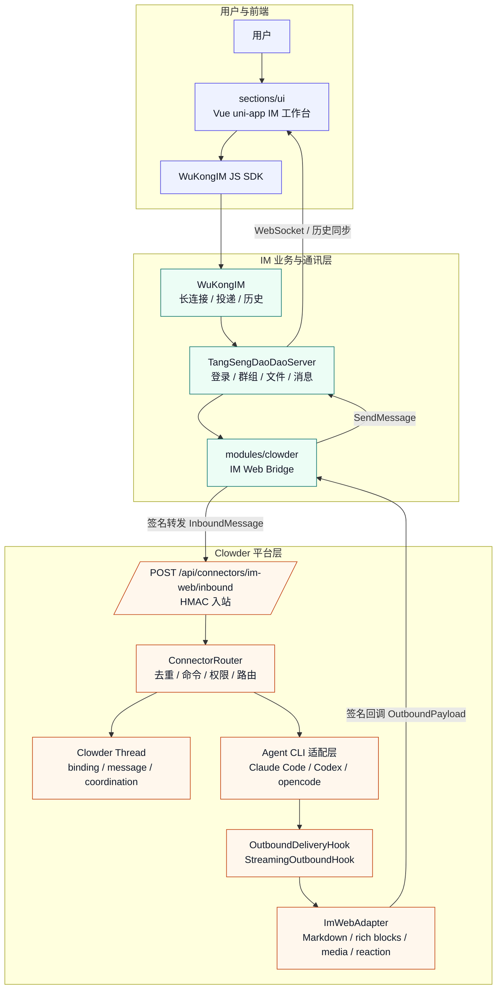

# AgentHub IM Clowder Architecture

System-level data flow between the Vue/uni-app IM surface, TangSengDaoDao/WuKongIM, and Clowder's connector runtime.

```mermaid
flowchart TB
    subgraph Client["用户与前端"]
        User[用户]
        UI[sections/ui<br/>Vue uni-app IM 工作台]
        SDK[WuKongIM JS SDK]
        User --> UI
        UI --> SDK
    end

    subgraph IM["IM 业务与通讯层"]
        WK[WuKongIM<br/>长连接 / 投递 / 历史]
        TSDD[TangSengDaoDaoServer<br/>登录 / 群组 / 文件 / 消息]
        Bridge[modules/clowder<br/>IM Web Bridge]
        SDK --> WK
        WK --> TSDD
        TSDD --> Bridge
    end

    subgraph Clowder["Clowder 平台层"]
        Inbound[/POST /api/connectors/im-web/inbound<br/>HMAC 入站/]
        Router[ConnectorRouter<br/>去重 / 命令 / 权限 / 路由]
        Thread[Clowder Thread<br/>binding / message / coordination]
        Agents[Agent CLI 适配层<br/>Claude Code / Codex / opencode]
        Delivery[OutboundDeliveryHook<br/>StreamingOutboundHook]
        Adapter[ImWebAdapter<br/>Markdown / rich blocks / media / reaction]
        Inbound --> Router
        Router --> Thread
        Router --> Agents
        Agents --> Delivery
        Delivery --> Adapter
    end

    Bridge -->|签名转发 InboundMessage| Inbound
    Adapter -->|签名回调 OutboundPayload| Bridge
    Bridge -->|SendMessage| TSDD
    TSDD -->|WebSocket / 历史同步| UI

    classDef ui fill:#eef2ff,stroke:#4f46e5,color:#111827
    classDef im fill:#ecfdf5,stroke:#0f766e,color:#111827
    classDef clowder fill:#fff7ed,stroke:#c2410c,color:#111827

    class User,UI,SDK ui
    class WK,TSDD,Bridge im
    class Inbound,Router,Thread,Agents,Delivery,Adapter clowder
```
