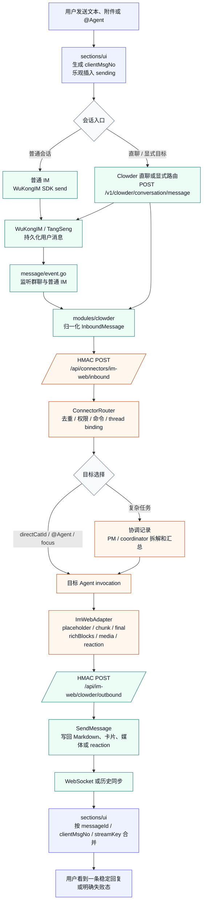

# IM Clowder Message Lifecycle

A vertical view of how a user message enters IM, routes through Clowder, and returns as one stable chat message.

```mermaid
flowchart TB
    Start[用户发送文本、附件或 @Agent]
    UI[sections/ui<br/>生成 clientMsgNo<br/>乐观插入 sending]
    Route{会话入口}
    SDK[普通 IM<br/>WuKongIM SDK send]
    Direct[Clowder 直聊或显式路由<br/>POST /v1/clowder/conversation/message]
    Persist[WuKongIM / TangSeng<br/>持久化用户消息]
    Listener[message/event.go<br/>监听群聊与普通 IM]
    Normalize[modules/clowder<br/>归一化 InboundMessage]
    Inbound[/HMAC POST<br/>/api/connectors/im-web/inbound/]
    Router[ConnectorRouter<br/>去重 / 权限 / 命令 / thread binding]
    Target{目标选择}
    Agent[目标 Agent invocation]
    Coord[协调记录<br/>PM / coordinator 拆解和汇总]
    Adapter[ImWebAdapter<br/>placeholder / chunk / final<br/>richBlocks / media / reaction]
    Outbound[/HMAC POST<br/>/api/im-web/clowder/outbound/]
    Send[SendMessage<br/>写回 Markdown、卡片、媒体或 reaction]
    Sync[WebSocket 或历史同步]
    Merge[sections/ui<br/>按 messageId / clientMsgNo / streamKey 合并]
    Done[用户看到一条稳定回复<br/>或明确失败态]

    Start --> UI
    UI --> Route
    Route -->|普通会话| SDK
    Route -->|直聊 / 显式目标| Direct
    SDK --> Persist
    Direct --> Persist
    Persist --> Listener
    Listener --> Normalize
    Direct --> Normalize
    Normalize --> Inbound
    Inbound --> Router
    Router --> Target
    Target -->|directCatId / @Agent / focus| Agent
    Target -->|复杂任务| Coord
    Coord --> Agent
    Agent --> Adapter
    Adapter --> Outbound
    Outbound --> Send
    Send --> Sync
    Sync --> Merge
    Merge --> Done

    classDef ui fill:#eef2ff,stroke:#4f46e5,color:#111827
    classDef im fill:#ecfdf5,stroke:#0f766e,color:#111827
    classDef clowder fill:#fff7ed,stroke:#c2410c,color:#111827
    classDef decision fill:#f8fafc,stroke:#64748b,color:#111827

    class Start,UI,Merge,Done ui
    class SDK,Direct,Persist,Listener,Normalize,Outbound,Send,Sync im
    class Inbound,Router,Agent,Coord,Adapter clowder
    class Route,Target decision
```
