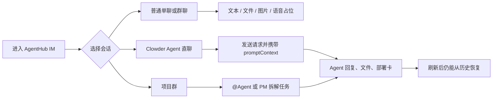
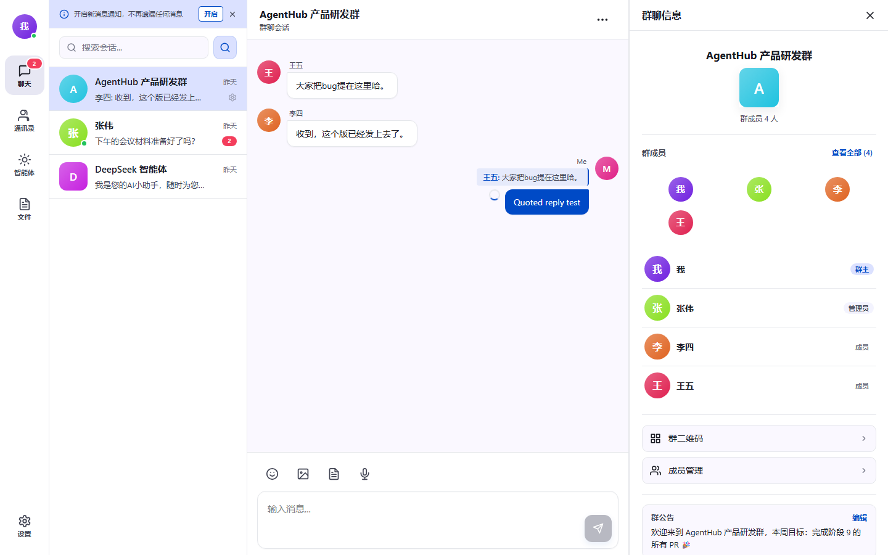
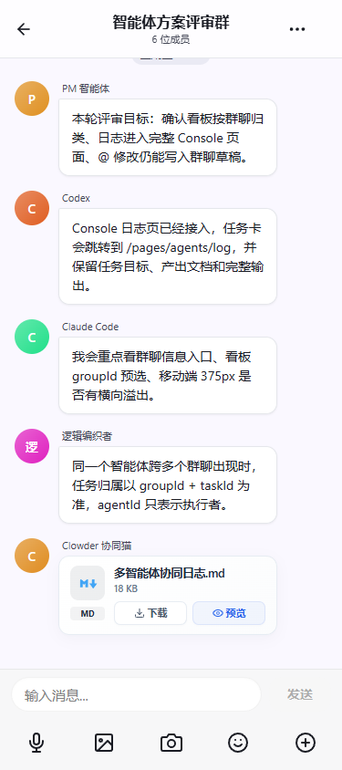
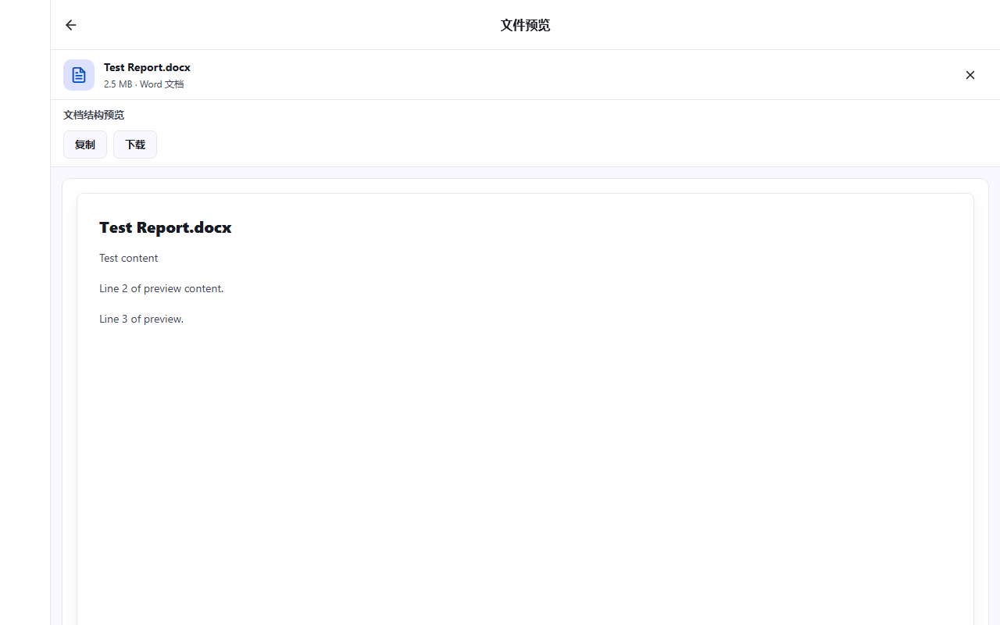
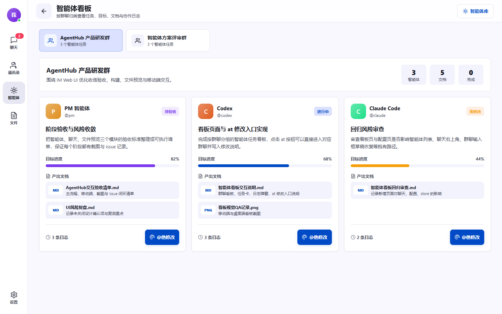
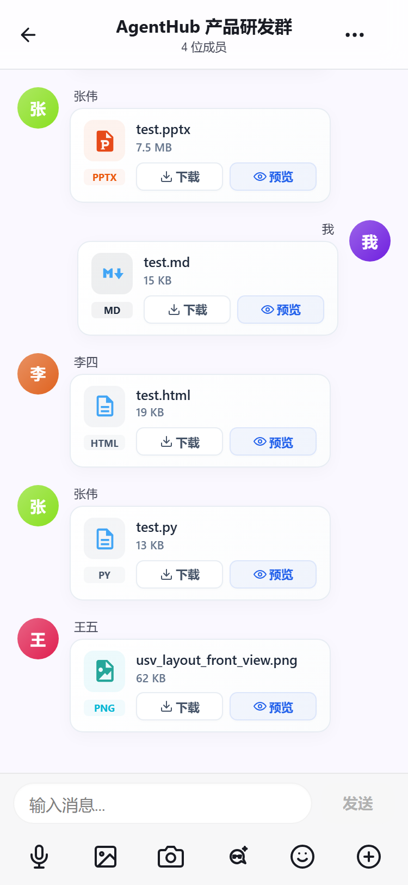

# AgentHub IM 与 Clowder 多智能体协作 PRD

> 版本：v1.1
> 日期：2026-06-10
> 依据范围：`sections/im`、`sections/clowder-ai`、`sections/ui`
> 文档定位：给产品评审、交付验收和后续开发排期使用。实现细节见 [技术文档](./技术文档.md)。

## 1. 文档读法

这份 PRD 先回答三个问题：

1. 用户为什么要在 IM 里使用多智能体。
2. 当前产品要交付哪些可见能力。
3. 什么情况算完成，什么情况需要继续打磨。

本文内容以本仓代码和测试截图为准，覆盖问题定义、目标、用户故事、验收标准和范围边界。

## 2. 产品一句话

AgentHub IM 把人和 Clowder 智能体放进同一条 IM 消息流——用户像聊天一样发消息、@ Agent、确认卡片、收文件、看部署结果，不用在多个工具之间搬运上下文。

## 3. 要解决的问题

### 3.1 用户侧问题

| 问题 | 现在的表现 | 产品要给出的答案 |
| --- | --- | --- |
| 多 Agent 切换成本高 | 用户需要在 Claude Code、Codex、opencode 等工具间搬运上下文 | 在 IM 中通过 @、焦点和项目群把任务送到合适的 Agent |
| 群聊协作难留痕 | 人和 Agent 的分工、回复、文件、部署动作散落在不同工具的聊天记录里 | @ Agent、协调记录、卡片和右侧面板把操作留在当前会话中 |
| 结果不稳定 | 流式回复、刷新、重连后可能出现重复气泡或丢失上下文 | 用 `messageId`、`clientMsgNo`、`streamKey` 合并消息 |
| 权限边界不清 | 群里谁能授权、谁能置顶、谁能触发 Agent 容易混在一起 | 群角色、白名单、管理员命令和 Pin 权限分开处理 |
| 交付物难检查 | 代码、文件、预览、部署请求和日志散在各处，看不到和原始需求的关联 | 文件卡、部署卡、项目群卡和 Agent 看板各自指向源消息和 thread，可一路回溯 |

### 3.2 系统已有基础

- `sections/im` 提供 TangSengDaoDao 业务层和 WuKongIM 通讯层，负责登录、好友、群组、消息持久化、WebSocket、多端同步和文件上传。
- `sections/clowder-ai` 提供 Clowder 平台层，负责线程、Agent 注册、命令、技能、记忆、协作记录、Connector Router 和出站投递。
- `sections/ui` 是 Vue/uni-app 版本的 AgentHub IM 前端，已经有桌面工作台、移动聊天、智能体页、文件预览、Clowder 面板、部署卡、项目群卡和技能页。

### 3.3 为什么不用现有工具凑合

用户现在也能凑合：Claude Code 里和 Agent 对话，微信群或飞书里和同事同步，手动把 Agent 输出截图贴到群里。但这种拼凑有几个绕不开的代价：

| 现有方式 | 痛点 | AgentHub IM 的替代 |
| --- | --- | --- |
| Claude Code / Codex 终端直连 | 上下文只在自己终端里，同事看不到 Agent 回复；多人协同时需要手动复制粘贴 | Agent 回复直接落群聊，所有人可见、可回溯 |
| 微信群 + 手动搬运 | 消息和 Agent 输出割裂，无法 @ Agent；文件散落在聊天记录里，没有结构化卡片 | 同一消息流里 @ Agent、收卡片、看文件 |
| 多个 Agent 工具切换 | 不同 Agent 在不同工具里，上下文不互通，需要手动记住谁在处理什么 | Clowder 统一路由，协调器拆任务分派 |
| 飞书/钉钉机器人 | 单向通知多，交互少；不支持流式回复和多轮协作 | 双向流式对话、确认卡、部署卡、项目群 |

## 4. 目标与非目标

### 4.1 本阶段目标

| 目标 | 说明 | 优先级 |
| --- | --- | --- |
| IM 基础稳定 | 单聊、群聊、会话列表、消息同步、文件/图片/语音占位可用 | P0 |
| Clowder 直聊 | 用户可把一个 Clowder Agent 当作联系人直接聊天 | P0 |
| 群聊 @ Agent | 群聊中 @ 单个或多个 Agent，消息进入对应 Clowder thread | P0 |
| 主 Agent 协调 | 复杂任务可由 PM/协调者拆解、派发、汇总 | P0 |
| 流式回复合并 | Agent 的 placeholder、chunk、final 最终落成一条稳定回复 | P0 |
| 技能与模板 | 用户可查看技能、添加技能、把技能分配给可见 Agent；缺失模板 Agent 可通过卡片补齐 | P1 |
| 项目群闭环 | PM 直聊中可创建项目群，把用户、PM Agent 和执行 Agent 拉到同一协作空间 | P1 |
| 产物与部署 | Agent 产物、文件、部署请求用卡片呈现，支持确认、取消、重试 | P1 |
| 跨端体验 | 桌面、平板、移动视口下主流程不遮挡、不横向溢出 | P1 |

### 4.2 暂不承诺

- 不把 Clowder 的所有后台能力搬到 IM 前端。IM 只承接用户需要在聊天里看到和操作的部分。
- 不在浏览器里保存 Clowder 密钥。签名、转发和默认 owner 都在后端配置。
- 不承诺所有 rich blocks 都有专属 UI。当前优先支持 Markdown、文件、媒体、部署卡、项目群卡；其他 rich blocks 先降级为可读文本或通用卡片。

## 5. 用户角色

| 角色 | 典型诉求 | 关注点 |
| --- | --- | --- |
| 普通协作用户 | 在聊天里问问题、发文件、查看结果 | 入口简单，回复不重复，失败能看懂 |
| 项目负责人 | 把一个想法拆成任务，跟踪多人和多 Agent 的进度 | 项目群、看板、协作记录、部署状态 |
| 执行开发者 | 让不同 Agent 做实现、审查、部署准备 | @ 路由准确，文件和日志可回溯 |
| 管理员 | 控制群里是否允许 Agent、哪些命令可用 | 白名单、角色快照、审计信息 |

## 6. 体验主线

## 7. 主要功能

### 7.1 IM 消息中心

消息中心负责所有消息的收发、同步和状态管理。普通用户只看到”发出去、收回来、历史还在”，但内部要稳定处理本地乐观插入、SDK 回包、历史同步和 Clowder 出站回写。

| 能力 | 产品表现 | 验收要点 |
| --- | --- | --- |
| 文本消息 | 输入后立即显示，成功后状态稳定 | `sending -> success`，失败可保留并重试 |
| 媒体和文件 | 图片、文件以卡片或预览入口展示 | 文件名、大小、下载、预览状态完整 |
| 群聊消息 | 头像、昵称、时间、@ 提醒可读 | 群成员多时不遮挡消息内容 |
| 引用回复 | 发送时带引用摘要，可跳转到原消息 | 切换会话时不残留旧引用 |
| Reaction/ACK | Agent 可对用户消息给出“已收到”反馈 | silent reaction 不产生空消息 |
| 历史恢复 | 刷新、重连后消息顺序和摘要正常 | 无重复气泡，无丢失最终回复 |

消息状态统一为：

| 类型 | 状态 |
| --- | --- |
| 用户消息 | `sending`、`success`、`failed`、`revoked`、`edited` |
| Agent 流式回复 | `placeholder`、`chunk`、`final`、`cleanup` |
| 产品态 | `queued`、`streaming`、`done`、`error`、`cancelled` |

### 7.2 Clowder 直聊

用户可以把一个 Clowder Agent 看成联系人，例如 `clowder_cat:coordinator` 或某个运行时创建的 Agent。直聊时，前端走 `/v1/clowder/conversation/message`，后端先把用户消息持久化到 IM，再把归一化后的消息转给 Clowder。

验收标准：

- Agent 目录中的显示名、别名、能力标签不会退化为技术 ID。
- 用户消息发送成功后，最近文本会进入本地 `promptContext` 缓存，用于下一次直聊补上下文。
- Agent 回复以 Markdown 渲染；流式更新只占一条消息。
- 失败时显示可理解的失败态，不让用户以为消息已经被处理。

### 7.3 群聊 @ Agent

群聊是人和智能体一起工作的地方。产品默认不鼓励 Agent 随便插话，路由优先级如下：

1. 明确 @ 或 `directCatId`。
2. `targetCatIds` 或 `/ask` 指定的目标。
3. 当前 thread 的 focus 或最近活跃 Agent。
4. 复杂任务或未指定目标时，回到协调者。

验收标准：

- 用户在群聊中 @ 一个 Agent，只触发目标 Agent。
- 用户 @ 多个 Agent 或提出“拆解、协调、部署、规划”类任务时，协调者可生成协作记录。
- 群未授权时，Agent 不执行，并给出可见提示。
- 管理员命令和普通成员命令权限不同，拒绝原因要明确。

### 7.4 主 Agent 协调器

协调器的价值不是“多说几句”，而是把复杂任务拆成能执行、能检查的步骤。当前设计中，协调器适合处理以下任务：

- 从一句需求里拆出子任务。
- 决定哪个 Agent 做实现、审查、部署准备。
- 生成项目群或协作记录。
- 汇总结果，并把产物链接、文件或卡片留在会话里。

协调状态建议：

| 状态 | 含义 |
| --- | --- |
| `planning` | 正在理解需求和拆任务 |
| `dispatching` | 正在分派给执行 Agent |
| `running` | 子任务进行中 |
| `aggregating` | 正在汇总结果 |
| `succeeded` | 已完成并回写结果 |
| `failed` / `cancelled` | 失败或被取消 |

### 7.5 项目群

项目群用于把 PM 直聊中的一个项目拉成独立群聊。后端 `ensureProjectGroup` 会确保项目群存在，并把用户、PM Agent 和必要成员放进群里。重复创建同名项目时，优先复用已有绑定。

验收标准：

- PM 直聊中能生成“创建项目群”确认卡。
- 确认后创建或复用项目群，群名、成员、项目 thread 绑定正确。
- 项目群里能继续 @ Agent，右侧 Clowder 面板能显示 project thread、workspace、focus 和 Agent 列表。
- 项目群入口能从会话列表和卡片回到对应群聊。

### 7.6 技能、模板与 Agent 目录

前端智能体页既展示静态 Agent，也同步 Clowder 目录和用户技能。

验收标准：

- Agent 列表能展示系统 Agent、用户创建 Agent 和 Clowder 运行时 Agent。
- 技能市场、我的技能、技能分配可用；技能只能分配给当前用户可见的 Agent。
- 上传技能包时，后端拒绝不安全 zip 路径。
- 角色模板使用 `cat-template.json`，创建 Agent 后同步名称、别名、简介和能力标签。

### 7.7 产物、文件和部署卡

Agent 的结果不一定是一段文字。它可能是文件、代码、项目预览、部署请求或日志。产品上需要把这些产物保留为可点击、可检查的对象。

| 类型 | 展示方式 | 操作 |
| --- | --- | --- |
| 文件 | 文件卡片 | 下载、预览 |
| Markdown/代码 | 消息 Markdown 或文件预览 | 查看、复制、后续可接 diff |
| 部署请求 | 部署确认卡 | 确认、取消、重试、查看日志 |
| 项目群 | 项目群卡 | 打开项目群、查看绑定状态 |
| 缺失模板 Agent | 模板 Agent 确认卡 | 创建、取消、重试 |

### 7.8 右侧工作区与移动端退路

桌面端的右侧工作区用于文件预览、Clowder 面板和项目上下文。移动端不能把聊天区挤到不可读，因此右侧工作区要切换为独立页面或覆盖层。

验收标准：

- 1440px 桌面下，左侧导航、会话列表、聊天区、右侧工作区都能看清。
- 375px 移动端下，输入框、工具栏、发送按钮不遮挡消息。
- 长文件名、长群名、长 Agent 名不压住时间和状态。
- 暗色模式、通知提示、空态和错误态可读。

## 8. 截图证据

以下截图来自本仓测试和手工验收目录，用来说明当前 UI 已覆盖的主要路径。图片不是 PRD 的唯一依据，但能帮助评审快速看到产品形态。

| 场景 | 截图 | 说明 |
| --- | --- | --- |
| 群聊回复与成员侧栏 | `./evidence/desktop-group-reply.png` | 群聊消息、引用回复、成员信息侧栏 |
| 移动端 AI 消息回复 | `./evidence/mobile-ai-replies.png` | 多个 Agent 回复、文件卡、移动输入区 |
| 桌面文件预览 | `./evidence/desktop-file-preview.png` | 文档预览、下载、复制和关闭入口 |
| 智能体看板 | `./evidence/desktop-agent-board.png` | 多 Agent 任务、产出文档、日志入口 |
| 移动端文件卡 | `./evidence/mobile-file-cards.png` | 群聊文件卡、下载、预览、移动输入区 |

### 8.1 群聊与 AI 回复

### 8.2 预览、看板与文件卡

## 9. 用户故事与验收

### US-01：用户能进入稳定的 IM 工作台

作为普通用户，我进入 AgentHub 后，可以在桌面端看到会话列表和聊天区，在移动端看到适合触控的聊天页面。

验收：

- 桌面、平板、移动视口均无横向溢出。
- 会话列表能显示未读、置顶、免打扰、草稿和 @ 提醒。
- 登录过期、网络异常、SDK 不可用时有可见恢复提示。

### US-02：用户能直接和一个 Agent 聊天

作为用户，我打开一个 Clowder Agent 联系人，输入需求后，希望该 Agent 收到我的消息并在同一会话中回复。

验收：

- 直聊会话使用 `clowder_cat:` 联系人 ID 规整，但 UI 显示人类可读名称。
- 消息先落 IM，再进入 Clowder 路由。
- Agent 回复不重复，Markdown 可读。
- 本地 prompt context 只缓存当前用户成功发送的文本消息。

### US-03：群聊里 @ Agent 可以准确路由

作为群成员，我在群聊中 @ Codex 或协调者，希望只触发目标 Agent，并保留群成员身份。

验收：

- InboundMessage 包含 `sender`、`externalChatId`、`mentions`、`sourceRoleSnapshot`。
- 群角色为 owner、manager、member、departed 时能正确归一。
- 非授权群或非管理员命令被拒绝。
- Agent 回复能回写到同一个群聊。

### US-04：复杂任务能进入协调流程

作为项目负责人，我在群里说“帮我做一个项目，PM 拆一下并安排执行”，希望协调者给出计划并把任务分派出去。

验收：

- 复杂任务词或多个目标 Agent 会触发 coordination 记录。
- 协调状态从 `planning` 开始，可在看板或右侧面板查看。
- 结果汇总回到聊天消息流，文件和日志可继续点开。

### US-05：用户能创建项目群并继续协作

作为用户，我在 PM 直聊中确认创建项目群后，希望项目群包含我、PM Agent 和执行 Agent，并能继续推进项目。

验收：

- 项目群同名重复创建时复用 active binding。
- 群名长度和引号被规范化，避免生成难读名称。
- 项目群创建后有明确跳转入口。
- 项目群 thread ID 能回写到 binding。

### US-06：部署请求有确认闭环

作为用户，当 Agent 建议部署预览时，我希望看到清晰的部署卡，确认后能看到 queued/running/succeeded/failed 等状态。

验收：

- 部署卡必须带 `deploymentRequestId`、source message、target、environment。
- 确认、取消、重试都走结构化接口，不降级成自然语言消息。
- 后端返回失败时卡片保留，并显示失败原因。

### US-07：技能和模板 Agent 可管理

作为用户，我希望给 Agent 添加技能，或在缺少模板 Agent 时一键创建。

验收：

- 技能市场可显示哪些技能已添加。
- 技能分配只允许当前用户可见的 Agent。
- 上传 zip 必须拒绝路径穿越和不安全文件名。
- 模板 Agent 创建后，名称、别名、简介、能力标签同步到前端列表和会话。

### US-08：刷新和重连后不丢上下文

作为长期使用者，我刷新页面或网络重连后，希望聊天记录、最终回复、卡片和文件仍然可找回。

验收：

- 历史消息按频道同步，保留本地 prompt context 所需的近期成功文本。
- 流式消息按 `streamKey` 合并。
- silent reaction 不生成新的空消息。
- cleanup 事件不生成空气泡。

## 10. 异常与边界

| 场景 | 期望处理 |
| --- | --- |
| Clowder 未配置 | 状态接口返回 disabled/unconfigured，UI 显示不可用，不暴露密钥 |
| Clowder 不可达 | 返回 `agent_directory_unavailable`、`message_failed` 等明确错误 |
| WuKongIM SDK 不可用 | 模拟数据可以继续展示；真实发送标记失败或本地成功 fallback |
| 群未授权 | 不触发 Agent，提示管理员使用授权命令 |
| 队列满 | 不假装已执行；卡片或消息保留可重试状态 |
| 媒体不支持 | 以文本说明或文件 fallback 展示 |
| 重复 webhook | Clowder dedup 跳过重复消息 |
| 长文本/长名称 | 截断或换行，不遮挡时间、按钮和状态 |

## 11. 指标

| 指标 | 测量方式 | 目标 |
| --- | --- | --- |
| 首屏可识别 | 新用户进入后 5 秒内口头说出当前所在模块名称。5 人测试，取通过率 | ≥ 4/5 通过 |
| 消息无重复 | 连续 10 次刷新页面，检查 Agent 回复是否出现重复气泡 | 0 次重复 |
| 路由准确率 | 在群聊中 @ 单个 Agent 发送 20 条消息，统计进入目标 Agent 的比例 | 100% |
| 失败可解释 | 遍历 10 类已知失败场景，检查前端是否展示具体原因而非”请求失败” | 10/10 可解释 |
| 跨端主流程 | 在 375px / 768px / 1024px / 1440px 视口下走完”登录→发消息→收 Agent 回复→查看文件” | 4/4 通过 |
| 交付可追溯 | 从产物卡/部署卡/项目群卡点击后，能否定位到源消息或 thread | 100% 可回溯 |

## 12. 发布计划

| 阶段 | 内容 | 依赖 | 预计工期 | 退出条件 |
| --- | --- | --- | --- | --- |
| Phase 1：IM 基线 | 登录、会话、消息、文件、移动适配 | 无 | 2-3 周 | UI smoke + 消息同步通过 |
| Phase 2：Clowder 直聊 | Agent 目录、直聊、prompt context、流式合并 | Phase 1 | 2-3 周 | 直聊刷新无重复 |
| Phase 3：群聊协作 | 群聊 @、白名单、协调记录、右侧面板 | Phase 2 | 2-3 周 | 群聊多 Agent smoke 通过 |
| Phase 4：项目与产物 | 项目群、看板、部署卡、文件/预览 | Phase 2（可与 Phase 3 并行） | 2-3 周 | 手工链路截图齐全 |
| Phase 5：技能与治理 | 技能市场、模板 Agent、权限和审计 | Phase 2（可与 Phase 3/4 并行） | 2-3 周 | 安全和权限测试通过 |

## 13. 事实索引

| 结论 | 代码或材料 |
| --- | --- |
| TangSeng/WuKongIM 是 IM 消息底座 | `sections/im/TangSengDaoDaoServer/README.md` |
| Clowder bridge 注册在 TangSeng 模块中 | `sections/im/TangSengDaoDaoServer/modules/clowder/1module.go` |
| IM 消息进入 Clowder 时归一为 `InboundMessage` | `sections/im/TangSengDaoDaoServer/modules/clowder/normalize.go` |
| 后端监听 IM 消息并转发到 Clowder | `sections/im/TangSengDaoDaoServer/modules/message/event.go` |
| Clowder 出站回调写回 IM | `sections/im/TangSengDaoDaoServer/modules/clowder/outbound.go`、`api.go` |
| `im-web` connector 在 Clowder connector registry 中有定义 | `sections/clowder-ai/packages/shared/src/types/connector.ts` |
| Clowder 侧 `ImWebAdapter` 支持流式、媒体、reaction | `sections/clowder-ai/packages/api/src/infrastructure/connectors/adapters/ImWebAdapter.ts` |
| 前端消息合并、prompt context、reaction 由 native-im 状态层处理 | `sections/ui/services/native-im/message-state.js` |
| 前端 Clowder API 汇聚在 native IM service | `sections/ui/services/native-im/service.js` |
| 智能体目录、技能、模板在 Agent store 中呈现 | `sections/ui/stores/agent.js` |
| UI 验证截图覆盖群聊、AI 回复、预览、智能体看板和文件卡 | `assets/roadmap/evidence/` |

## 14. 开放问题

| 问题 | 当前建议 | 决策人 | 预计关闭时间 |
| --- | --- | --- | --- |
| Rich blocks 是否全部做专属组件 | 先做部署、项目群、模板 Agent、文件预览；其余先降级为 Markdown | 产品 + 前端 lead | Phase 3 结束前 |
| Clowder manual context pin 和 IM 置顶是否做一个入口 | 暂时分开。IM 置顶影响聊天窗口，manual context pin 影响 Agent 长期上下文 | 产品 + Clowder 侧 | Phase 4 结束前 |
| 群聊默认 Agent 是否主动回复 | 默认不主动，除非 @、focus、命令或协调任务触发 | 产品 | Phase 3 结束前 |
| 移动端右侧面板如何进入 | 用独立页面或覆盖层，不挤压聊天详情 | 前端 + 设计 | Phase 1 结束前 |
| 技能包是否允许热加载到真实运行时 | 当前先完成上传、归属、分配和 UI 管理；热加载需要安全审查后再开放 | 安全 + Clowder 侧 | Phase 5 结束前 |
