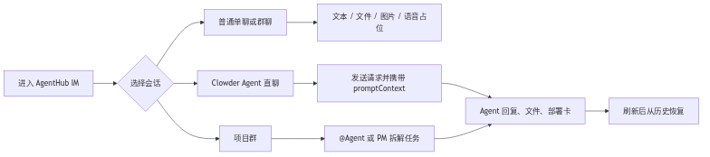
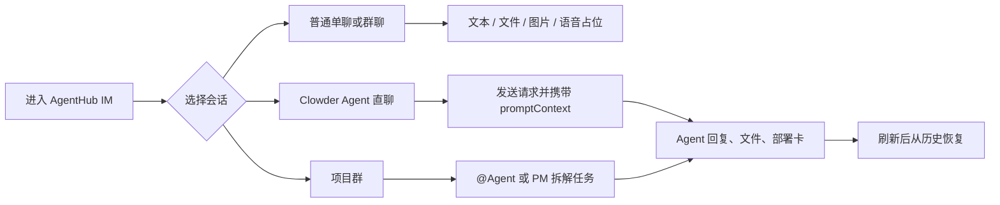
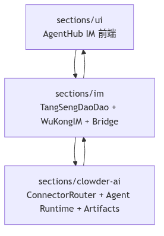
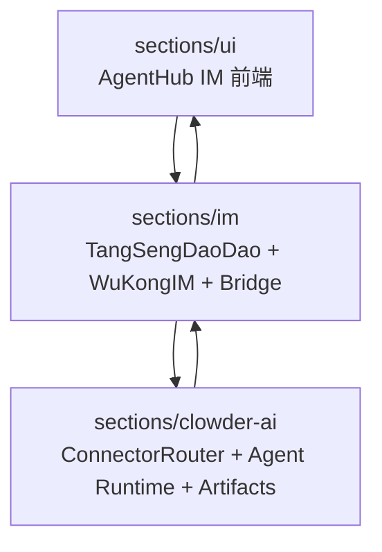

# AgentHub IM Clowder 章节图片索引

来源文档：[`../AgentHub_IM_Clowder_综合交付文档.md`](../AgentHub_IM_Clowder_综合交付文档.md)

## 6. 体验主线

类型：Mermaid flowchart

图片：[`06-experience-mainline.png`](./06-experience-mainline.png)

源码：[`06-experience-mainline.mmd`](./06-experience-mainline.mmd)

## 8.1 三层边界

类型：Mermaid flowchart

图片：[`08-01-three-layer-boundary.png`](./08-01-three-layer-boundary.png)

源码：[`08-01-three-layer-boundary.mmd`](./08-01-three-layer-boundary.mmd)

## 17. 截图证据

类型：PNG 截图

| 章节 | 场景 | 图片 |
| --- | --- | --- |
| 17 | 群聊回复与成员侧栏 | [`../evidence/desktop-group-reply.png`](../evidence/desktop-group-reply.png) |
| 17 | 移动端 AI 消息回复 | [`../evidence/mobile-ai-replies.png`](../evidence/mobile-ai-replies.png) |
| 17 | 桌面文件预览 | [`../evidence/desktop-file-preview.png`](../evidence/desktop-file-preview.png) |
| 17 | 智能体看板 | [`../evidence/desktop-agent-board.png`](../evidence/desktop-agent-board.png) |
| 17 | 移动端文件卡 | [`../evidence/mobile-file-cards.png`](../evidence/mobile-file-cards.png) |

## 其他图片

综合交付文档正文没有直接引用以下图片，但它们位于同一 roadmap 资产目录，可按需要纳入其他文档：

| 位置 | 图片 |
| --- | --- |
| `assets/roadmap/figures` | [`../figures/agenthub-im-clowder-architecture.png`](../figures/agenthub-im-clowder-architecture.png) |
| `assets/roadmap/figures` | [`../figures/im-clowder-message-lifecycle.png`](../figures/im-clowder-message-lifecycle.png) |
| `assets/roadmap` | [`../goal.png`](../goal.png) |
