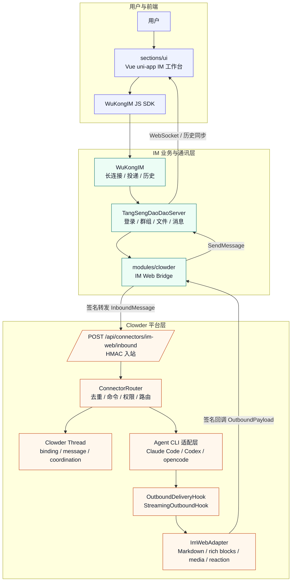
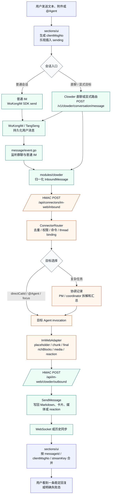

# AgentHub IM 与 Clowder 技术文档

> 版本：v1.2
> 日期：2026-06-10
> 关联 PRD：[prd产品需求文档.md](./prd产品需求文档.md)
> 综合交付文档：[AgentHub_IM_Clowder_综合交付文档.md](./AgentHub_IM_Clowder_综合交付文档.md)
> 覆盖范围：`sections/im`、`sections/clowder-ai`、`sections/ui`

## 1. 总览

这份文档记录 AgentHub IM 接入 Clowder 的当前实现和约束。系统拆成三块，各自负责一段，边界不能混：

- `sections/ui` 负责用户看得到的部分：IM 工作台、消息状态、Agent 目录、技能、项目群、部署卡和跨端布局。
- `sections/im` 负责 TangSengDaoDao 业务 API、WuKongIM 通讯、消息持久化、群组/好友/文件，以及 Clowder bridge。
- `sections/clowder-ai` 负责 Agent 团队本体：thread、connector、命令、路由、技能、记忆、协作记录、出站投递和运行时调用。

有几条线不能踩：浏览器不碰 Clowder 密钥；IM 后端不复制 Clowder 路由逻辑；Clowder 也不接管 TangSeng/WuKongIM 的 IM 存储。

### 1.1 按角色阅读

| 角色 | 优先阅读 | 暂时可略过 |
| --- | --- | --- |
| 产品 / 评审 | §1 总览、§2 架构图、§7 消息生命周期、§20 测试与验证 | §6 数据结构、§9 鉴权细节、§12-18 实现要点 |
| 前端开发 | §1 总览、§3 源码地图（前端部分）、§6.3 UI 消息对象、§7 消息生命周期、§8.1 接口、§11 前端实现要点 | §14-18 后端运行时细节 |
| 后端开发 | §1 总览、§3 源码地图（后端部分）、§6 数据结构、§8 接口、§9 鉴权、§10 幂等恢复、§12-18 实现要点 | §11 前端实现要点 |
| 测试 | §1 总览、§7 消息生命周期、§8 接口、§10 幂等恢复、§20 测试与验证 | §11-18 实现要点 |

## 2. 架构图

图文件放在这里（`.mmd` 是 Mermaid 源文件，`.md` 是渲染中间格式，`.png` 是导出的静态图）：

- `./figures/agenthub-im-clowder-architecture.mmd`
- `./figures/agenthub-im-clowder-architecture.md`
- `./figures/agenthub-im-clowder-architecture.png`



## 3. 源码地图

| 区域 | 主要文件 | 职责 |
| --- | --- | --- |
| 前端 API 聚合 | `sections/ui/services/native-im/service.js` | 登录、SDK 初始化、消息同步、Clowder API、技能、项目群、部署请求 |
| 前端消息状态 | `sections/ui/services/native-im/message-state.js` | 消息摘要、去重、流式合并、prompt context、reaction、pending feedback |
| 前端 Agent 状态 | `sections/ui/services/native-im/agent-state.js`、`sections/ui/stores/agent.js` | Clowder Agent 目录、直聊联系人、技能、角色模板、删除屏蔽 |
| 前端消息 Store | `sections/ui/stores/message.js` | 本地乐观插入、发送、同步、项目群卡、部署卡、模板 Agent 卡 |
| 前端聊天 UI | `sections/ui/components/chat/*.vue` | 消息气泡、输入区、文件卡、Clowder 面板、右侧工作区 |
| TangSeng bridge 配置 | `sections/im/TangSengDaoDaoServer/modules/common/clowder_config.go` | `IM_WEB_CLOWDER_ENABLED`、Clowder API、secret、owner、超时 |
| TangSeng 签名 | `sections/im/TangSengDaoDaoServer/modules/common/clowder_signature.go` | HMAC SHA-256 签名与时间窗校验 |
| TangSeng Clowder 模块 | `sections/im/TangSengDaoDaoServer/modules/clowder/*.go` | API、inbound/outbound 归一化、项目群、技能、manual context pins、媒体 |
| IM 消息监听 | `sections/im/TangSengDaoDaoServer/modules/message/event.go` | 注册消息监听器，把 IM 消息转发到 Clowder |
| Clowder connector 类型 | `sections/clowder-ai/packages/shared/src/types/connector.ts` | `im-web` connector definition、thread binding 类型 |
| Clowder inbound | `sections/clowder-ai/packages/api/src/infrastructure/connectors/ImWebInboundHandler.ts` | 校验 IM 签名，调用 `ConnectorRouter.route()` |
| Clowder 路由 | `sections/clowder-ai/packages/api/src/infrastructure/connectors/ConnectorRouter.ts` | 去重、白名单、命令、thread binding、@ 解析、coordination 记录 |
| Clowder 命令 | `sections/clowder-ai/packages/api/src/infrastructure/connectors/ConnectorCommandLayer.ts` | `/where`、`/new`、`/use`、`/threads`、`/focus`、`/ask`、`/allow-group` 等 |
| Clowder 出站 | `sections/clowder-ai/packages/api/src/infrastructure/connectors/adapters/ImWebAdapter.ts` | 发送 Markdown、rich blocks、媒体、reaction、流式 placeholder/chunk/final |
| Clowder 投递 hook | `OutboundDeliveryHook.ts`、`StreamingOutboundHook.ts` | thread 绑定查找、文件发布、语音 fallback、流式清理 |
| Agent runtime | `sections/clowder-ai/packages/api/src/domains/cats/services/agents/providers/*AgentService.ts`、`types.ts` | Claude/Codex/Gemini/Kimi/OpenCode 等 provider 调用、流式事件、MCP 回调环境 |
| Agent 路由 | `sections/clowder-ai/packages/api/src/domains/cats/services/agents/routing/AgentRouter.ts`、`route-serial.ts`、`route-parallel.ts` | direct / serial / parallel / coordinator 路由，A2A worklist 执行 |
| 多 Agent 协调 | `MultiMentionOrchestrator.ts`、`CoordinatorDispatcher.ts`、`CoordinatorPlanner.ts`、`CoordinatorAggregator.ts` | 多目标分派、协调计划、结果聚合、coordination 状态 |
| A2A handoff | `a2a-mentions.ts`、`a2a-shadow-detection.ts`、`WorklistRegistry.ts` | Agent 输出中的行首 @ 解析、shadow 检测、ping-pong/深度防护 |
| Session Chain | `SessionManager.ts`、`SessionSealer.ts`、`RedisSessionChainStore.ts`、`RuntimeSessionStore.ts` | CLI session 生命周期、seal、handoff、runtime session 元数据 |
| 产物与部署 | `domains/deployments/DeploymentExecutor.ts`、`DeploymentRequestStore.ts`、`DeploymentJobStore.ts`、`StaticSiteDeploymentExecutor.ts`、`SourcePackageExecutor.ts` | 部署请求、静态预览、源码包、容器计划、状态卡 |
| 预览网关 | `domains/preview/preview-gateway.ts`、`port-validator.ts`、`port-discovery.ts`、`bridge-script.ts`、`ws-patch-script.ts` | localhost 预览代理、端口校验、HTML 注入、HMR WebSocket patch |
| 可观测性 | `infrastructure/telemetry/*`、`test/telemetry/*` | OpenTelemetry trace/metric/log、redaction、local trace store、burn-rate monitor |
| 角色模板 | `sections/clowder-ai/cat-template.json` | 模板 Agent 的名称、别名、简介、能力和默认模型 |

## 4. 运行时拓扑

### 4.1 浏览器 / uni-app

前端把 TangSeng API 收在 `nativeImService` 里。普通文本和媒体优先走 WuKongIM JS SDK；Clowder 直聊、结构化卡片和部分右侧面板数据走 `/v1/clowder/*`。

Pinia 里主要有这些状态：

| Store | 状态 |
| --- | --- |
| `app.js` | 登录用户、主题、通知、全局运行态 |
| `navigation.js` | 当前模块、桌面/移动导航 |
| `conversation.js` | 会话列表、选中会话、草稿、未读 |
| `message.js` | 消息列表、发送状态、卡片状态、同步状态 |
| `agent.js` | Agent 列表、技能、OAuth 能力、模板 |
| `group.js` | 群信息、成员、群智能体 |
| `file.js` | 文件列表和预览 |
| `settings.js` | 设备、主题、通知和隐私设置 |

### 4.2 TangSengDaoDao / WuKongIM

TangSengDaoDao 是 IM 业务层。它处理用户、好友、群、文件、消息 API 和 Clowder bridge。WuKongIM 是通讯层，负责长连接、消息投递和消息存储。

Clowder bridge 注册在 TangSeng 模块里：

- `modules/clowder/1module.go` 注册 API 和 SQL。
- `modules/message/event.go` 在 bridge 配置完整时注册消息监听器。
- `modules/clowder/api.go` 暴露 `/v1/clowder/*` 和 `/api/im-web/clowder/outbound`。

### 4.3 Clowder

Clowder 把 `im-web` 当作一个 connector。收到 inbound 后，`ConnectorRouter` 按这个顺序处理：

1. 去重。
2. 群白名单和命令权限检查。
3. 处理 slash command。
4. 查找或创建 thread binding。
5. 存储 connector message。
6. 解析 @ 和显式目标 Agent。
7. 触发 Agent invocation。
8. 通过 `OutboundDeliveryHook` 和 `ImWebAdapter` 回写 IM。

## 5. 配置

TangSeng bridge 从环境变量读取配置：

| 环境变量 | 说明 | 默认 |
| --- | --- | --- |
| `IM_WEB_CLOWDER_ENABLED` | 是否启用 Clowder bridge | `false` |
| `CLOWDER_API_BASE_URL` | Clowder API 地址 | 空 |
| `CLOWDER_CONNECTOR_ID` | connector ID | `im-web` |
| `CLOWDER_CONNECTOR_SECRET` | 双向 HMAC secret | 空 |
| `CLOWDER_DEFAULT_OWNER_USER_ID` | TangSeng 代理访问 Clowder 时使用的 owner | 空 |
| `CLOWDER_REQUEST_TIMEOUT_MS` | 请求 Clowder 超时 | `5000` |
| `CLOWDER_SIGNATURE_TOLERANCE_MS` | 签名时间窗 | `300000` |

前端可配置：

| 配置 | 来源 | 默认 |
| --- | --- | --- |
| TangSeng API base URL | `native_api_base_url` storage、`VITE_TANGSENG_API_BASE_URL`、`VITE_API_BASE_URL` | `/v1/` |
| Clowder direct fallback base URL | `clowder_api_base_url` storage、`VITE_CLOWDER_API_BASE_URL` | `/clowder-api/api/` |

Clowder runtime 常用配置：

| 配置 | 说明 | 默认 |
| --- | --- | --- |
| `CLOWDER_API_PORT` | Clowder API 服务端口 | `3002` |
| `REDIS_URL` | Redis 连接地址；为空时部分 store 使用内存回退 | 空 |
| `CAT_CAFE_PROJECT_RUNTIME_ROOT` | Agent 临时运行目录 | `./runtime` |
| `MAOMI_WORKSPACE_ROOT` | 用户项目源码根目录 | `./workspace` |
| `UPLOAD_DIR` | 浏览器可访问媒体和交付物目录 | `./uploads` |
| `DEPLOYMENT_DATA_DIR` | 部署 job、静态站点预览和源码包目录 | `./data/deployments` |
| `CAT_{CATID}_MODEL` | 覆盖指定 Agent 默认模型 | 空 |
| `ANTHROPIC_API_KEY` / `OPENAI_API_KEY` | provider 账户密钥，实际注入由 account/runtime 配置控制 | 空 |

## 6. 数据结构

### 6.1 InboundMessage

TangSeng 将 IM 消息归一为 `InboundMessage` 后发给 Clowder：

| 字段 | 含义 |
| --- | --- |
| `connectorId` | 固定为 `im-web` |
| `externalChatId` | `"{channelType}:{channelIdOrFakeChannelId}"` |
| `channelId` / `channelType` | TangSeng 会话标识 |
| `chatType` | `direct` 或 `group` |
| `messageId` / `clientMsgNo` / `messageSeq` | 幂等和历史恢复所需标识 |
| `text` | 从 payload 中提取的文本，非文本可 fallback 为 URL/name |
| `sender` | `{ id, name }` |
| `attachments` | 图片、音频、文件或 unsupported |
| `mentions` | TangSeng mention uids |
| `directCatId` / `targetCatIds` | 前端显式路由目标 |
| `promptContext` | Clowder 直聊的近期用户文本上下文 |
| `sourceRoleSnapshot` | 群角色快照 |

`externalChatId` 规则：

- 单聊：`channelType = 1`。虚拟 Clowder 直聊使用 TangSeng fake channel，避免不同用户共享同一个私聊频道。
- 群聊：`channelType = 2`，`channelId` 为群号。
- Clowder binding：`connectorId + externalChatId -> threadId`。

### 6.2 OutboundPayload

Clowder 通过 `ImWebAdapter` 回调 TangSeng：

| 字段 | 含义 |
| --- | --- |
| `connectorId` | `im-web` |
| `externalChatId` | 要写回的 IM 会话 |
| `threadId` / `invocationId` | 追踪 Clowder thread 和本次调用 |
| `catId` / `catDisplayName` | 回复来源 Agent |
| `content` / `format` | 文本内容，默认 Markdown |
| `richBlocks` | Clowder rich blocks，前端可逐步映射 |
| `media` | image、file、audio |
| `reaction` | silent reaction，附着到目标消息 |
| `stream` | `placeholder`、`chunk`、`final`、`cleanup` |
| `metadata` | 例如 `replyToSender` |
| `platformMessageId` | 流式消息稳定 ID |

TangSeng 出站转换规则：

- Markdown 文本落成普通文本消息，payload 带 `markdown: true`、`ai: true`。
- 图片和文件映射到 TangSeng content type。
- reaction 映射为 `type = 1000` 的 `clowder_reaction`，`NoPersist = 1`，`RedDot = 0`。
- `cleanup` 且内容为空时返回 no-op，不生成空消息。

### 6.3 UI 消息对象

前端消息对象由 `normalizeMessage()`、`defaultMsg()` 和 `message-state.js` 收敛，主要字段如下：

| 字段 | 含义 |
| --- | --- |
| `id`、`messageId`、`clientMsgNo`、`streamKey` | 去重和流式合并 |
| `senderId`、`senderName`、`senderAvatar` | 展示发送方 |
| `type` | text、image、file、voice、system、deployment_card、project_group_confirmation 等 |
| `content` | 展示正文 |
| `status` | sending、success、failed、revoked、edited |
| `streaming` | 是否仍处于流式更新中 |
| `renderMode` | Markdown 等渲染模式 |
| `replyRef` | 引用回复 |
| `mentions` | @ 信息 |
| `reactions` | 普通 reaction 和本地 pending feedback |
| `source` | `clowder`、`mock` 等 |

### 6.4 ProjectGroupBinding

项目群 binding 记录 PM 直聊和项目群之间的关系：

| 字段 | 含义 |
| --- | --- |
| `id` | binding ID |
| `userId` | 所属用户 |
| `projectName` | 规范化项目名 |
| `pmDirectChannelId` / `pmDirectChannelType` | PM 直聊频道 |
| `pmDirectThreadId` | PM 直聊 Clowder thread |
| `projectGroupNo` | TangSeng 群号 |
| `projectThreadId` | 项目群 Clowder thread |
| `pmMemberId` | PM 虚拟成员 |
| `userMemberIds` / `catMemberIds` | 成员集合 |
| `status` | active 等 |

### 6.5 AgentProfile

每个 Clowder Agent 都会落到 `AgentProfile` 或相近的运行时配置里。这里分成静态身份和运行能力两层，避免 UI 展示字段和 provider 调用字段混在一起。

| 层级 | 字段 | 用途 |
| --- | --- | --- |
| Identity | `id`、`name`、`displayName`、`nickname`、`avatar`、`color`、`mentionPatterns`、`roleDescription` | UI 展示、@ 解析、角色说明 |
| Runtime Profile | `clientId`、`defaultModel`、`cli`、`accountRef`、`sessionStrategy`、`mcpSupport` | provider 选择、账户隔离、会话策略和工具支持 |

`clientId` 用来隔开不同 provider 的实现差异：

| 平台 | clientId | 协议 | 说明 |
| --- | --- | --- | --- |
| Claude Code | `anthropic` | CLI + MCP | Anthropic 生态 |
| Codex | `openai` | CLI + MCP | OpenAI 生态 |
| Gemini | `google` | CLI + MCP | Google 生态 |
| Kimi | `kimi` | CLI + MCP | Moonshot 生态 |
| OpenCode | `opencode` | CLI + MCP | 开源生态 |
| A2A Agent | `a2a` | JSON-RPC 2.0 | 远程 Agent 协议预留 |

### 6.6 Invocation、Session 与 Coordination

Agent 调用、CLI session 和协调记录要分开建模。一条回复、一段 CLI session、一次多 Agent 协作不是同一个东西，混在一张表里后面很难查。

| 实体 | 主要字段 | 用途 |
| --- | --- | --- |
| `InvocationRecord` | `id`、`threadId`、`agentId`、`status`、`callbackToken`、`createdAt` | 单次 Agent 调用和 MCP 回调认证，`invocationId` 是幂等键 |
| `SessionRecord` | `id`、`status`、`usedTokens`、`windowTokens`、`fillRatio`、`messageCount`、`sealedAt` | CLI / provider session 生命周期，支持 handoff、compress、hybrid 策略 |
| `CoordinationRecord` | `id`、`threadId`、`status`、`goal`、`leadAgentId`、`participantAgentIds`、`subtasks`、`aggregateSummary` | 多 Agent 协调状态、子任务和最终汇总 |
| `Subtask` | `id`、`agentId`、`title`、`status`、`artifactRefs`、`result` | 协调器分派给具体 Agent 的可验收工作单元 |

状态机：

```text
Invocation: created -> running -> done
                         \-> error / cancelled

Session: active -> sealing -> sealed

Coordination: planning -> dispatching -> running -> aggregating -> succeeded
                                      \-> failed / cancelled

Subtask: todo -> doing -> done
              \-> blocked -> failed / cancelled
```

### 6.7 A2A Worklist

A2A handoff 依靠 worklist 记录一条 invocation 里的动态执行链，防止 Agent 互相 @ 后形成递归链。

| 字段 | 含义 |
| --- | --- |
| `list` | 待执行 Agent 列表，可由 A2A 动态扩展 |
| `originalCount` | 初始目标数 |
| `a2aCount` | A2A 扩展次数 |
| `maxDepth` | 最大深度 |
| `executedIndex` | 已执行到的下标 |
| `a2aFrom` | 每个 Agent 由谁 handoff 而来 |
| `a2aTriggerMessageId` | 触发 handoff 的消息 |
| `streakPair` | Agent 对之间的 ping-pong 计数 |

### 6.8 Artifact 与 Deployment

产物和部署必须能回溯到源消息、thread、task 和 Agent，否则聊天里的“部署成功”会变成不可审计的自然语言。

| 实体 | 主要字段 | 用途 |
| --- | --- | --- |
| `Artifact` | `id`、`threadId`、`sourceMessageId`、`taskId`、`type`、`path`、`deliveryUrl`、`metadata` | Agent 生成文件、补丁、预览、源码包或 workspace 的登记 |
| `ArtifactProvenance` | `sourcePath`、`sourceLayer`、`workspaceRelativePath`、`deliveryUrl` | 产物来源、存储层和浏览器可访问地址 |
| `DeploymentRequest` | `id`、`source`、`target`、`environment`、`status`、`sourceMessageId` | 用户确认前的部署意图 |
| `DeploymentJob` | `id`、`requestId`、`status`、`previewUrl`、`downloadUrl`、`logs` | 确认后的执行任务和状态卡数据 |

三层存储模型：

| 层级 | 用途 | 持久性 |
| --- | --- | --- |
| `runtime` | Agent 临时工作区 | 临时 |
| `userWorkspace` | 用户项目源码 | 持久 |
| `delivery` | 浏览器可访问媒体或交付物 | 持久 |

## 7. 消息生命周期

图文件放在这里：

- `./figures/im-clowder-message-lifecycle.mmd`
- `./figures/im-clowder-message-lifecycle.md`
- `./figures/im-clowder-message-lifecycle.png`



### 7.1 普通 IM 消息

UI 调用 WuKongIM SDK `send()`，先在本地插入 `sending`。SDK 或历史同步返回后，再按 `clientMsgNo`/`messageId` 合并，并由 `conversationSummaryForMessage()` 更新会话摘要。

### 7.2 Clowder 直聊

UI 识别到 `clowder_cat:` 会话后，调用 `/v1/clowder/conversation/message`，请求里带 `directCatId` 和 `promptContext`。TangSeng 先用 `BuildInboundPersistMessage()` 持久化用户消息，再用 `sendInboundTextWithRouting()` 转发给 Clowder。UI 会给源消息加 pending feedback，Agent 回复到达后清掉。

### 7.3 群聊路由

`MessagesListenWithRoles()` 监听群消息，查询成员角色（owner/manager/member/departed），再由 `NormalizeInboundMessage()` 归一化。Clowder `ConnectorRouter` 负责白名单、命令和 @ 判断：有明确目标就先走目标 Agent，复杂任务交给协调者。

### 7.4 流式回复

流式回复用 `platformMessageId` 做稳定 ID，TangSeng 侧 `StableStreamClientMsgNo(invocationId, platformMessageId)` 生成 `client_msg_no`。UI 按 `streamKey` 合并 chunk，final 后状态变 `success`。cleanup 为空时返回 no-op。

## 8. 接口清单

### 8.1 UI 到 TangSeng

| 接口 | 方法 | 用途 |
| --- | --- | --- |
| `/v1/user/login` | POST | 登录 |
| `/v1/conversation/sync` | POST | 同步会话 |
| `/v1/message/channel/sync` | POST | 同步消息历史 |
| `/v1/file/upload` | GET | 获取上传地址 |
| `/v1/clowder/status` | GET | Clowder bridge 状态 |
| `/v1/clowder/conversation` | GET | 当前会话 Clowder 状态 |
| `/v1/clowder/conversation/agents` | GET | 会话可用 Agent |
| `/v1/clowder/cats` | GET/POST/DELETE | Agent 目录、创建、删除 |
| `/v1/clowder/cats/connect` | POST | 连接已有 Agent |
| `/v1/clowder/conversation/bind` | POST | 绑定 IM 会话和 Clowder thread |
| `/v1/clowder/conversation/focus` | POST | 设置 focus Agent |
| `/v1/clowder/conversation/focus/clear` | POST | 清理 focus |
| `/v1/clowder/conversation/message` | POST | Clowder 直聊或显式路由消息 |
| `/v1/clowder/group/cats/sync` | POST | 同步群聊 Agent 列表 |
| `/v1/clowder/group/cats` | GET | 获取群聊 Agent |
| `/v1/clowder/project-groups/ensure` | POST | 创建或复用项目群 |
| `/v1/clowder/project-groups/active` | GET | 查询活跃项目群 binding |
| `/v1/clowder/project-groups/:bindingId/thread` | POST | 回写项目 thread |
| `/v1/clowder/skills/*` | GET/POST/PATCH/PUT/DELETE | 技能市场、用户技能、分配、上传 |
| `/v1/clowder/thread/:threadId/tasks` | GET | 查询 thread tasks |
| `/v1/clowder/thread/:threadId/artifacts` | GET/POST | 产物列表和登记 |
| `/v1/clowder/thread/:threadId/manual-context-pins` | GET/POST/DELETE | 长期上下文 pin |
| `/v1/clowder/conversation/deployment-request` | POST/GET/PATCH | 部署请求 |
| `/v1/clowder/conversation/deployment-action` | POST | 部署确认、取消、重试 |
| `/v1/clowder/thread/:threadId/workspaces` | GET | 查询 thread 关联 workspace |
| `/v1/clowder/preview/status` | GET | 预览系统状态或代理能力提示 |

### 8.2 TangSeng 到 Clowder

| Clowder 接口 | 方法 | 用途 |
| --- | --- | --- |
| `/api/connectors/im-web/inbound` | POST | IM 消息进入 ConnectorRouter |
| `/api/connectors/im-web/agents` | GET | 获取指定 externalChatId 可用 Agent |
| `/api/cat-templates` | GET | 获取角色模板和默认模型 |
| `/api/connectors/im-web/deployment-requests` | POST/GET/PATCH | 代理部署请求 |
| `/api/connectors/im-web/deployment-action` | POST | 代理部署动作 |
| `/api/threads/:threadId/tasks` | GET | 任务 |
| `/api/threads/:threadId/artifacts` | GET/POST | 产物 |
| `/api/threads/:threadId/workspaces` | GET | 工作区信息 |
| `/api/threads/:threadId/manual-context-pins` | GET/POST/DELETE/PATCH | 长期上下文 |

### 8.3 Clowder 到 TangSeng

| TangSeng 接口 | 方法 | 用途 |
| --- | --- | --- |
| `/api/im-web/clowder/outbound` | POST | Clowder 出站消息、流式更新、媒体、reaction 回写 IM |

### 8.4 Clowder runtime 内部接口

这些接口不要直接暴露给浏览器。前端如果要用，走 TangSeng bridge 或 Clowder 自有 Web UI。

| 接口 | 方法 | 用途 |
| --- | --- | --- |
| `/api/callbacks/post-message` | POST | Agent MCP 回调，携带 `invocationId` + `callbackToken` 认证 |
| `/api/callbacks/multi-mention` | POST | 多 Agent 分派结果回调或协调辅助 |
| `/api/deployments` | POST | 创建部署请求或 job |
| `/api/deployments/:id` | GET/PATCH | 查询或更新部署状态 |
| `/api/deployments/:id/preview/` | GET | 静态站点部署预览入口 |
| `/api/deployments/:id/download` | GET | 下载源码包 |
| `/api/preview/status` | GET | 预览网关状态 |
| `/api/preview/proxy/*` | GET/WS | localhost 反向代理和 HMR WebSocket patch，实际路径以路由实现为准 |

## 9. 鉴权和安全

### 9.1 双向 HMAC

TangSeng 转发 inbound 到 Clowder：

- Header：`x-im-web-timestamp`、`x-im-web-signature`
- 签名：`HMAC_SHA256(secret, timestamp + "." + rawBody)`
- Clowder 默认容忍 5 分钟时间差。

Clowder 回调 outbound 到 TangSeng：

- Header：`x-clowder-timestamp`、`x-clowder-signature`
- TangSeng 使用同一 secret 校验。
- 签名缺失、时间过期、签名不匹配都返回 401。

### 9.2 用户身份

- 浏览器访问 TangSeng 仍使用 TangSeng token。
- TangSeng 代理访问 Clowder 时使用 `CLOWDER_DEFAULT_OWNER_USER_ID` 写入 `x-cat-cafe-user`，避免把 Clowder 管理权限暴露给浏览器。
- 群消息会附带 `sourceRoleSnapshot`，用于 Clowder 判断管理员命令和群授权。

### 9.3 文件和技能安全

- 聊天文件先通过 TangSeng 文件上传接口拿上传地址，再发送媒体消息。
- Clowder 技能上传拒绝不安全 zip 路径。
- 富媒体和 rich blocks 先走白名单式展示；未支持类型降级为文本或通用文件。
- 产物登记和部署执行必须使用 `realpath` + `isInsideOrEqual` 类校验防路径逃逸。
- 源码包、静态部署和预览目录必须过滤 `.env`、`.pem`、`.key`、`secrets`、`node_modules` 等敏感或超大目录。
- 技能包、源码包和 artifact 文件名需要拒绝绝对路径、`..`、隐藏敏感文件和不安全字符。

### 9.4 MCP 回调认证

Agent runtime 通过 MCP 工具或 callback endpoint 回写消息时，不能只信任 thread ID 或 Agent ID。`/api/callbacks/post-message` 至少校验：

| 校验 | 说明 |
| --- | --- |
| `invocationId` | 单次调用的全局唯一 ID，也是回调幂等和归属判断依据 |
| `callbackToken` | 调用创建时生成的短生命周期 token |
| invocation 状态 | 只接受 running 或可恢复状态的回调 |
| thread / agent 归属 | 回调中的 thread、agent、targetAgents 必须与 invocation 记录匹配 |
| 重复窗口 | 对同一 thread、同一内容的短时间重复 callback 做 dedup |

### 9.5 预览与资源限制

预览网关和多 Agent 运行时都属于高风险入口，默认先收紧：

| 资源 | 限制 | 说明 |
| --- | --- | --- |
| 预览代理目标 | 仅 localhost / 127.0.0.1 | 禁止代理内网任意地址或网关自身 |
| 预览端口 | 白名单 + 系统端口排除 | 防止访问 Redis、数据库、SSH 等服务 |
| A2A 链深度 | 默认有限制，建议不超过 15 | 防止 Agent 无限递归 |
| Multi-mention 目标数 | 建议不超过 3 | 防止一次请求扇出过大 |
| A2A mention 目标数 | 建议不超过 2 | 控制 handoff 复杂度 |
| 源码包大小 | 建议 100MB 上限 | 防止打包占满磁盘 |
| 部署超时 | 建议 10 分钟 | 防止长时间占用执行器 |
| WebSocket 广播速率 | 按 thread 限流和告警 | 防止前端被刷屏或内存膨胀 |

## 10. 幂等、恢复和失败处理

| 风险 | 处理 |
| --- | --- |
| 重复 webhook | `InboundMessageDedup` 按 connector、externalChatId、externalMessageId 跳过 |
| 本地消息和服务端回包重复 | UI 按 `messageId`、`clientMsgNo` 合并 |
| 流式 chunk 重复或乱序 | UI 按 `streamKey` 合并，final 覆盖最终内容 |
| cleanup 产生空消息 | TangSeng 返回 `ErrOutboundNoop` |
| 群虚拟 Agent 发送者不可投递 | TangSeng 先确认虚拟用户可用，群聊必要时改用真实订阅者发送 |
| Clowder 不可达 | API 返回明确错误码，UI 保留失败态 |
| SDK 缺失或不可用 | mock 会话可本地成功，真实会话给失败或同步错误 |
| 项目群重复创建 | project group key 由 user、PM direct channel、项目名组成，active binding 优先复用 |

## 11. 前端实现要点

### 11.1 消息发送

`message.js` 中 `sendNativeMessage()` 是发送入口：

1. 根据当前会话生成 identity。
2. 本地插入消息。
3. 文本走普通 SDK 或 Clowder conversation message。
4. 媒体先上传再发送。
5. 成功后缓存 prompt context。
6. 失败时更新 `nativeError` 和 `syncError`。

### 11.2 消息合并

`message-state.js` 负责几类合并：

- `mergeNativeMessageIntoList()` 合并服务端消息。
- `mergeAgentReplyEventIntoList()` 合并 Agent placeholder/chunk/final。
- `applyReactionEventIntoList()` 把 silent reaction 加到源消息上。
- `applyAgentPendingFeedbackIntoList()` 在本地给“正在处理”反馈。
- `mergeSyncedMessagesPreservingLocalContext()` 同步历史时保留本地上下文消息。

### 11.3 Agent 目录

Agent 目录要把多种来源折成同一套 UI 数据：

- 静态系统 Agent。
- Clowder `/v1/clowder/cats` 返回的 Agent。
- Clowder direct fallback `/api/connectors/im-web/agents`。
- `cat-template.json` 中的模板。
- 用户创建的运行时 Agent。

直聊联系人 ID 用 `clowder_cat:` 前缀，但展示名优先来自 Clowder directory 和模板，避免 UI 暴露技术 ID。

### 11.4 卡片

现在主要看这几类卡片：

| 卡片 | 文件 | 状态 |
| --- | --- | --- |
| 部署确认卡 | `services/native-im/deployment.js`、`DeploymentCard.vue` | submitting、queued、running、succeeded、failed、cancelled |
| 项目群确认卡 | `services/native-im/project-group.js`、`CoordinatorProjectGroupCard.vue` | pending、creating、created、failed、cancelled |
| 模板 Agent 确认卡 | `services/native-im/coordinator-template-cats.js`、`CoordinatorTemplateCatsCard.vue` | pending、creating、created、partial、failed、cancelled |
| 文件卡 | `FileCard.vue`、`FilePreviewPanel.vue` | 下载、预览、失败 |

## 12. 后端实现要点

### 12.1 Inbound

`registerClowderBridgeListener()` 在配置齐全时注册监听器。每次收到 IM 消息：

1. 群聊查询成员角色。
2. 生成 `RawIMMessage`。
3. `NormalizeInboundMessage()` 提取文本、mention、attachment。
4. `Client.ForwardInbound()` 通过 HMAC 发送到 Clowder。

### 12.2 Outbound

`/api/im-web/clowder/outbound` 入口按下面走：

1. 读 raw body。
2. 校验 `x-clowder-*` 签名。
3. 解析 `OutboundPayload`。
4. 构建 TangSeng `MsgSendReq`。
5. 确认虚拟 Clowder 用户存在。
6. 群聊中加载订阅者，必要时改写发送者。
7. 调用 `ctx.SendMessage()` 写回 IM。

### 12.3 Proxy

TangSeng bridge 只代理浏览器确实要用的 Clowder 能力，这样浏览器仍然只访问 TangSeng：

- Agent directory。
- Cat templates。
- Skills。
- Project group。
- Deployment requests。
- Manual context pins。
- Thread tasks/artifacts/workspaces。

## 13. Clowder 路由要点

`ConnectorRouter.route()` 的顺序别轻易改：

1. 去重。
2. 发送 instant ACK reaction。
3. 群白名单检查。
4. slash command 拦截。
5. 媒体下载与语音转写。
6. 查找或创建 thread binding。
7. 写入 connector message。
8. 解析 @ 和显式目标。
9. 必要时创建 coordination record。
10. 触发 Agent invocation。

`im-web` 的目标选择规则：

- `directCatId` / `targetCatIds` 优先。
- 文本 @ 命中优先。
- 无明确目标时，优先协调者。
- 已有活跃参与者可兜底。

## 14. Agent Runtime 与 Session Chain

Clowder runtime 把“选择哪个 Agent”和“如何调用底层 provider”分开处理：`AgentRouter` 只做路由和执行模式选择，具体 provider 调用由 `AgentService` 实现。

### 14.1 AgentService 调用契约

`AgentService.invoke()` 以 async iterable 形式输出流式事件。上层用同一套消费逻辑处理 Claude Code、Codex、Gemini、Kimi、OpenCode 等 provider。

| 输入 | 说明 |
| --- | --- |
| `prompt` | 本轮要交给 provider 的最终 prompt |
| `sessionId` | CLI/provider session ID，可为空 |
| `workingDirectory` | Agent 执行工作目录 |
| `callbackEnv` | MCP 回调所需环境变量，例如 invocation/callback token |
| `accountEnv` | provider 账户环境变量，例如 API key 或 base URL |
| `contentBlocks` | 多模态内容块 |
| `signal` | 取消信号 |
| `auditContext` | 审计上下文 |
| `systemPrompt` | 静态身份提示 |
| `livenessProbe` | 存活探测标记 |

| 输出事件 | 用途 |
| --- | --- |
| `session_init` | 绑定 provider session，创建或更新 `SessionRecord` |
| `text` | 普通文本输出 |
| `tool_use` / `tool_result` | 工具调用和结果 |
| `status` / `system_info` / `provider_signal` | 运行时状态 |
| `a2a_handoff` | Agent 请求其他 Agent 继续处理 |
| `error` | 调用失败 |
| `done` | 调用完成，记录 token、审计和消息计数 |

### 14.2 单 Agent 调用流程

```text
创建 Invocation(invocationId + callbackToken)
  -> 解析 thread / user / target Agent
  -> SessionManager 获取或创建 session
  -> accountRef 解析 provider 账户
  -> 工作目录解析
  -> 必要时注入静态身份和上下文
  -> AgentService.invoke()
  -> 处理 session_init / text / tool / done / error
  -> 写入 message store、connector outbound 或 WebSocket
```

自愈策略：

| 场景 | 处理 |
| --- | --- |
| 缺失 session | 清除本地 session 绑定后重试 |
| prompt token limit / context overflow | 按策略 compress 或 handoff，再重试 |
| CLI timeout | 清除 session 并重试 |
| transient CLI exit | 最多重试 2 次 |
| provider 不可用 | 将 invocation 标记为 error，保留用户可见失败态 |

### 14.3 Session Chain

Session Chain 管长对话里的 provider session 生命周期。

| 策略 | 行为 | 适用场景 |
| --- | --- | --- |
| `handoff` | 上下文接近阈值时 seal 旧 session，开启新 session | 长任务、跨天项目 |
| `compress` | 自动压缩历史摘要后继续当前 session | 对连续上下文敏感的任务 |
| `hybrid` | 先 compress，仍超阈值再 handoff | 默认通用策略 |

自动 seal 看 `fillRatio = usedTokens / windowTokens`。session 进入 `sealed` 后不再接新调用，但仍能用于上下文回溯和审计。

## 15. 多 Agent 协调与 A2A

### 15.1 路由模式

Agent 路由分为四类：

| 模式 | 触发 | 执行方式 |
| --- | --- | --- |
| direct | 单个明确目标，且任务简单 | 直接调用目标 Agent |
| serial | 多步任务或 A2A worklist | 按顺序调用，允许 handoff 扩展 |
| parallel | ideate / 多 Agent 独立观点 | 多 Agent 并行响应，最后聚合 |
| coordinator | 无 @、@coordinator、多 @、复杂任务词 | 协调者拆解、分派、聚合 |

协调触发规则尽量别漂：

1. 无显式提及 -> coordinator。
2. 显式 @coordinator -> coordinator。
3. 多个显式 @ -> coordinator 或 parallel，取决于 intent。
4. 单 @ + “协调、规划、部署、分工、architect、plan”等复杂任务词 -> coordinator。
5. 单 @ + 简单任务 -> direct。

### 15.2 Coordination Record

协调器需要把计划、分派、执行和汇总都落到 store，避免只靠自然语言回复。

```text
planning -> dispatching -> running -> aggregating -> succeeded
                    \-> failed / cancelled
```

落库点：

- `CoordinatorPlanner` 生成可执行计划。
- `CoordinatorDispatcher` 创建或更新 coordination 与 subtasks。
- `MultiMentionOrchestrator` 管理多目标请求、响应和超时。
- `CoordinatorAggregator` 汇总多 Agent 结果，写入最终消息和 artifact refs。
- `CoordinatorKickoffStore` 可保存项目群推荐或 kickoff 信息。

### 15.3 A2A mention 解析

A2A 解析必须比普通 @ 更严格，避免代码块、日志或引用文本误触发其他 Agent。

规则：

1. 先剥离 fenced code block。
2. 只匹配行首 mention，可允许 markdown quote 前缀。
3. 使用 longest-match-first + token boundary，避免 `@opus-45` 误命中 `@opus`。
4. 不允许 Agent handoff 给自己。
5. 单次 A2A mention 目标数有限制。
6. 记录 `a2aTriggerMessageId`，便于目标 Agent 获取上下文。

### 15.4 Worklist 防护

`WorklistRegistry` 以 parent invocation 隔离每条 A2A 链。

| 防护 | 说明 |
| --- | --- |
| maxDepth | 防止无限递归 |
| ping-pong streak | 同一对 Agent 来回 handoff 达阈值后警告或阻断 |
| anti-cascade | 当前 Agent 已在活跃 multi-mention 中时，拒绝额外级联 |
| queue fairness | 线程级队列繁忙时停止扩展 A2A 链 |
| substantive work reset | 只有有工具调用或足够内容的实质工作才重置 ping-pong 计数 |

## 16. 产物与部署

### 16.1 产物登记

Agent 产物要显式登记，不能只把路径写进聊天文本。

```text
Agent 生成文件
  -> agenthub_declare_artifact
  -> 路径合法性和存在性校验
  -> 分类 runtime / userWorkspace / delivery
  -> 关联 thread / task / source message / agent
  -> UI 文件卡、看板或预览入口展示
```

| 类型 | 展示方式 | 说明 |
| --- | --- | --- |
| `code` | 代码块或文件预览 | 支持复制和后续 diff |
| `doc` | Markdown 渲染 | 交付文档 |
| `image` | 图片预览 | 走可访问 delivery URL |
| `preview` | iframe 或预览入口 | 通常来自静态部署或本地服务 |
| `file` | 文件卡 | 下载、预览、失败态 |
| `patch` | Diff 视图 | 后续可接应用补丁能力 |
| `workspace` | 文件树 | 用于项目级产物 |

### 16.2 部署请求与执行

部署分为 request 和 job 两层：request 是用户待确认意图，job 是确认后的执行任务。

```text
用户或 Agent 发起部署请求
  -> DeploymentRequestStore 记录 pending request
  -> UI 部署卡展示确认/取消
  -> 用户确认后创建 DeploymentJob
  -> DeploymentExecutor 执行
  -> StaticSiteDeploymentExecutor 生成 previewUrl
  -> SourcePackageExecutor 生成 downloadUrl
  -> detectContainerPlan 生成容器计划
  -> DeploymentJobStore 更新状态和日志
```

部署状态建议：

```text
request: pending -> confirmed -> cancelled
job: queued -> running -> succeeded
              \-> failed / cancelled
```

### 16.3 源码包与敏感文件

源码包生成不能依赖系统 `tar` 一条路，也要留下可审计的过滤规则：

- 排除 `.git`、`node_modules`、`.env`、`*.pem`、`*.key`、`secrets`。
- 限制源码包大小，例如 100MB。
- 支持长路径时需要稳定处理 prefix/name。
- 如果静态 preview 成功但源码包失败，部署卡应显示部分成功和明确错误。

## 17. 预览网关

预览网关负责把本地 dev server 或静态部署安全地嵌入 AgentHub。

### 17.1 请求代理流程

```text
浏览器请求 preview gateway
  -> 校验 __preview_port 或 deployment id
  -> 端口白名单 + 系统端口排除
  -> Origin 校验
  -> 禁止代理到网关自身
  -> proxy to localhost
  -> 剥离 X-Frame-Options / CSP frame-ancestors
  -> HTML 注入 bridge-script 和 ws-patch-script
  -> 返回给浏览器
```

### 17.2 HTML 注入

HTML 注入只对 `text/html` 响应生效。若响应 gzip 压缩，需要先解压、修改、再按原策略压缩。注入脚本职责：

- bridge script：让预览页面能把状态、截图或交互消息发回宿主。
- ws patch script：把 Vite、Webpack、SockJS 等 HMR WebSocket 自动补上 `__preview_port`。

### 17.3 安全边界

预览是用户最容易感知的功能，也是高风险入口。默认限制：

- 只代理 localhost / 127.0.0.1。
- 排除 Redis、数据库、SSH、系统管理端口。
- 禁止从预览页读取 Clowder secret。
- iframe 权限按最小能力开放。
- 预览失败时返回可读错误，不暴露本地绝对路径和 secret。

## 18. 并发、可观测性与运维

### 18.1 并发一致性

| 场景 | 机制 | 说明 |
| --- | --- | --- |
| 同一 Session 并发调用 | Session mutex | 按 CLI session 串行化 |
| 同一 thread 多 Agent | InvocationQueue | 队列化执行，保证顺序和可恢复 |
| 多 thread 并行 | parentInvocationId 隔离 | WorklistRegistry 按 invocation 隔离 |
| WebSocket 广播 | `seq` + `seqEpoch` | 断线重连后补拉或全量刷新 |
| A2A 级联 | WorklistRegistry | maxDepth、ping-pong、anti-cascade 防护 |

### 18.2 指标与日志

先看这些指标：

- `agent.invocation.count`
- `agent.invocation.duration`
- `agent.token.usage`
- `agent.message.count`
- `websocket.broadcast.rate`
- `deployment.success.rate`
- connector inbound/outbound success/error count
- dedup hit count
- A2A blocked / warning count

审计日志至少记录：

| 字段 | 含义 |
| --- | --- |
| `actor` / `actorId` | user、agent、system 及其 ID |
| `action` | send message、invoke agent、declare artifact、deploy、pin、allow group 等 |
| `targetType` / `targetId` | message、invocation、deployment、coordination、thread |
| `details` | 路由原因、权限结果、错误码、metadata |
| `ip` / `userAgent` | 外部请求审计上下文 |

### 18.3 启动与优雅关闭

Clowder API 启动顺序：

1. 初始化 Fastify、CORS、cookie、WebSocket。
2. 初始化 Redis、SQLite、本地 fallback stores。
3. 创建 message/thread/task/coordinator/session/deployment stores。
4. 注册 provider AgentService 和 Agent registry。
5. 初始化 AgentRouter、ConnectorRouter、OutboundDeliveryHook、StreamingOutboundHook。
6. 初始化 DeploymentExecutor、PreviewGateway、PortDiscoveryService。
7. 注册 routes 和 connector gateway。
8. 启动 task runner、reaper、telemetry。
9. 监听端口。

优雅关闭：

- 停止接收新请求。
- 释放 invocation leases。
- drain runtime sessions 或标记可恢复。
- 关闭 WebSocket。
- flush telemetry。
- 关闭 Redis/SQLite。

## 19. Pin 与上下文

这里有两个容易混淆的概念：

| 名称 | 所属层 | 用途 |
| --- | --- | --- |
| IM Pin | TangSeng message module | 聊天窗口置顶消息，多端同步，受群主/管理员/群配置限制 |
| Manual context pin | Clowder thread | 给 Agent prompt 的长期上下文，可标记源消息状态 |

产品上可以互相引用源消息，但不要把权限、数据表和状态混成一套。

## 20. 测试与验证

### 20.1 已有测试入口

| 类型 | 路径 |
| --- | --- |
| TangSeng bridge normalization/outbound/listener | `sections/im/TangSengDaoDaoServer/modules/clowder/*_test.go` |
| TangSeng bridge config/signature | `sections/im/TangSengDaoDaoServer/modules/common/clowder_*_test.go` |
| Clowder connector/router/adapter | `sections/clowder-ai/packages/api/src/infrastructure/connectors/*` 对应测试 |
| Clowder Agent 路由/A2A/协调 | `sections/clowder-ai/packages/api/src/domains/cats/services/agents/routing/*` 对应测试 |
| Clowder session/store | `sections/clowder-ai/packages/api/src/domains/cats/services/session/*`、`stores/*` 对应测试 |
| 部署系统 | `sections/clowder-ai/packages/api/src/domains/deployments/*` 对应测试 |
| 预览系统 | `sections/clowder-ai/packages/api/src/domains/preview/*` 对应测试 |
| 可观测性 | `sections/clowder-ai/packages/api/test/telemetry/*` |
| UI native IM 状态 | `sections/ui/tests/native-im.test.mjs` |
| UI 视觉截图 | `assets/roadmap/evidence/` |
| UI 效果证据 | `assets/roadmap/evidence/` 中的群聊、AI 回复、文件预览、智能体看板和文件卡截图 |

### 20.2 推荐门禁

```bash
cd sections/ui && npm test
cd sections/ui && npm run build
cd sections/im/TangSengDaoDaoServer && go test ./modules/common ./modules/clowder
cd sections/clowder-ai && pnpm test
cd sections/clowder-ai && pnpm build
```

新增能力最好补这些定向测试：

```bash
cd sections/clowder-ai/packages/api && pnpm test -- --runInBand test/telemetry
cd sections/clowder-ai/packages/api && pnpm test -- --runInBand test/domains
cd sections/clowder-ai/packages/api && pnpm test -- --runInBand test/infrastructure
```

Mermaid 图验证：

```bash
npx -y @mermaid-js/mermaid-cli@latest -i assets/roadmap/figures/agenthub-im-clowder-architecture.mmd -o /tmp/agenthub-architecture.png
npx -y @mermaid-js/mermaid-cli@latest -i assets/roadmap/figures/im-clowder-message-lifecycle.mmd -o /tmp/im-clowder-message-lifecycle.png
```

### 20.3 手工 smoke

| 流程 | 检查点 |
| --- | --- |
| 普通聊天 | 发送、失败、重试、刷新历史 |
| Clowder 直聊 | directCatId、promptContext、ACK、流式合并 |
| 群聊 @ | 群角色快照、白名单、目标 Agent、回写群聊 |
| 多 Agent 协调 | coordination 记录、subtask 状态、结果聚合、artifact refs |
| A2A handoff | 行首 @ 解析、代码块不误触发、ping-pong 阻断、handoff 审计 |
| 项目群 | PM 直聊创建项目群、复用 binding、打开项目群、同步 Agent |
| 产物 | artifact 登记、路径校验、文件卡、下载、源消息回溯 |
| 部署卡 | 创建、确认、取消、重试、日志 |
| 预览 | 静态预览、本地端口代理、HMR WebSocket patch、失败提示 |
| 技能 | 市场、添加、分配、删除、上传安全 |
| 移动端 | 375px 输入区、文件卡、长按菜单、右侧面板退路 |

## 21. 已知风险

| 优先级 | 风险 | 影响 | 处理方向 |
| --- | --- | --- | --- |
| P0 | 项目群 binding 当前以内存态为主 | 重启后可能要重新发现或补持久化 | 将 active binding 落库，并补迁移测试 |
| P0 | A2A 或 multi-mention 防护阈值不清 | 可能出现级联调用、成本飙升或消息刷屏 | 固定 maxDepth、目标数、ping-pong 阈值并加入审计 |
| P0 | 部署/产物路径校验不足 | 可能泄露敏感文件或打包过大目录 | 所有 artifact/deployment 路径走 realpath + allowlist，并加安全测试 |
| P1 | `ClowderPanel.vue` 仍有部分模拟任务数据 | 右侧面板可能与真实 thread 状态不一致 | 逐步接入 `/v1/clowder/thread/*` 和 project group active binding |
| P1 | 真实 Clowder 与 TangSeng 启动顺序不固定 | 首次进入可能显示 unconfigured 或 unavailable | UI 区分 disabled、unconfigured、unreachable |
| P1 | Session Chain 状态和 IM 历史不同步 | 长任务恢复时 Agent 上下文与用户可见历史不一致 | session seal、summary、manual context pin 都要可回溯到 thread message |
| P1 | 预览网关代理过宽 | 可能访问本机敏感服务 | 端口白名单、系统端口排除、禁止递归代理和 Origin 校验 |
| P2 | rich blocks 专属组件不完整 | 一些 Agent 输出只能以 Markdown 或文本显示 | 先按使用频率补部署、artifact、diff、checklist |
| P2 | 移动端右侧工作区路径仍需打磨 | 面板可能占屏或返回路径不统一 | 用独立路由承接 Clowder panel、文件预览和部署日志 |

## 22. 维护笔记

- 扩展 Clowder 能力前，先确认它应该落在聊天消息、右侧面板、Agent 看板还是设置页。
- 新增卡片时，一起补消息类型、状态机、失败态、刷新恢复路径和截图验收点。
- Connector 字段优先改 `InboundMessage` / `OutboundPayload`，不要让 UI 去解析临时字符串。
- 新增群聊能力前，写清楚普通成员、管理员、群主和 departed 成员分别能做什么。
- 更新角色模板后，同步检查前端展示名、别名、能力标签和直聊联系人。
- 接新 provider 时，先落 `AgentService` 能力矩阵、session 策略和 callback redaction，再接 UI。
- 新增 handoff 行为时，同时更新 Worklist 防护、coordination 状态和审计字段。
- 新增部署目标时，同步定义 artifact provenance、敏感文件过滤、失败卡片和下载/预览回溯。
- 预览代理默认从拒绝开始，逐项加入白名单和 Playwright/浏览器 smoke。
- 新增主链路时，同步加 trace span、metric、redaction 测试和失败事件名。
