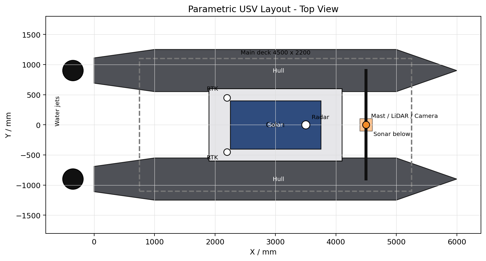
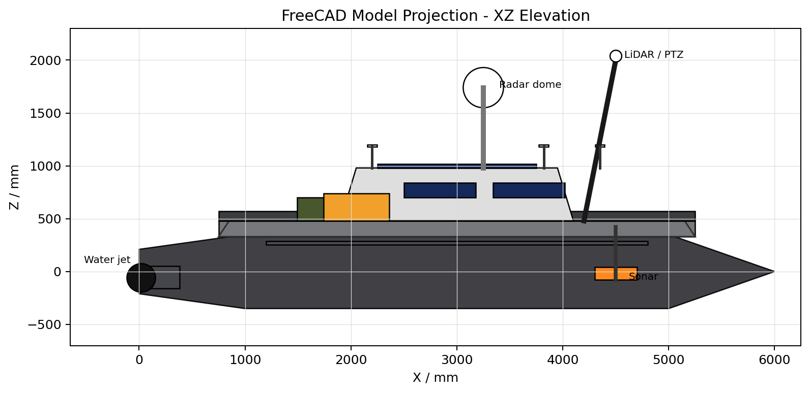
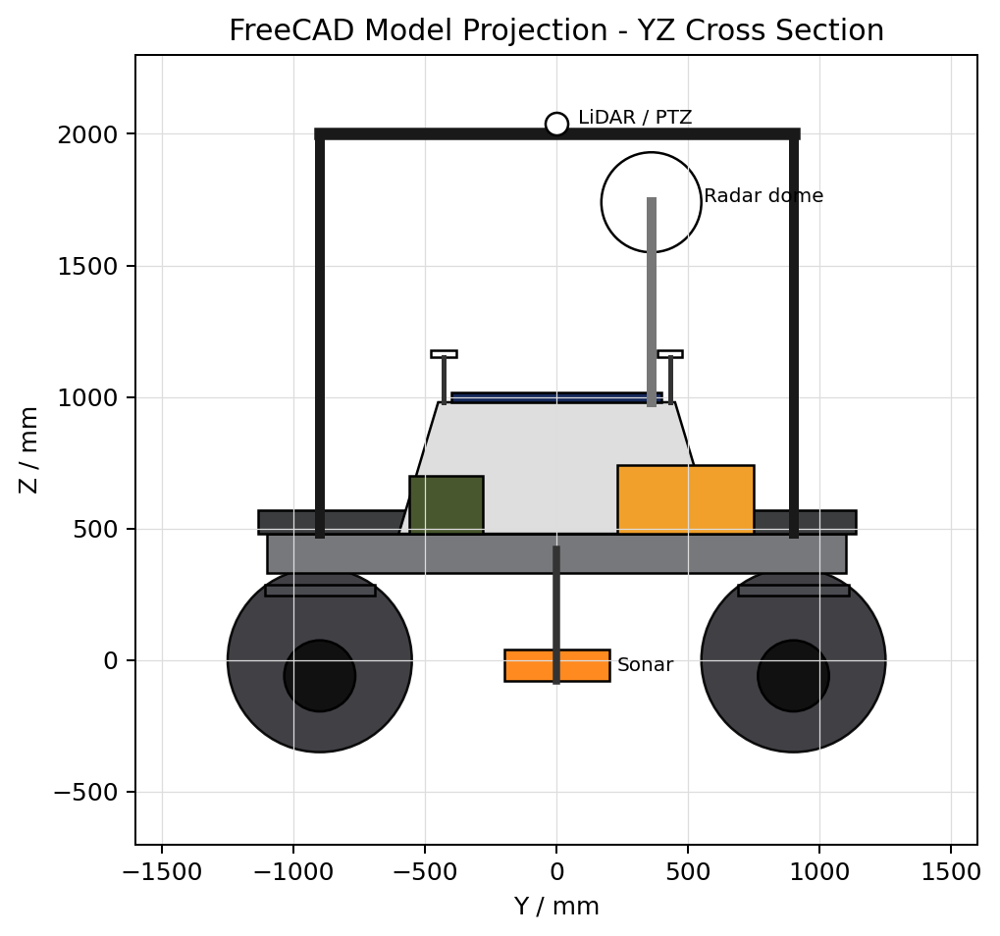

# 摘要

面向智能无人船的小批量、多型号、快速迭代制造需求，本文根据给定文章中“由系统描述生成 FreeCAD 三维模型”的案例，建立一套面向先进制造技术的参数化建模方法。模型以双体无人船为对象，采用“系统功能描述—结构参数—几何实体—制造约束”的建模路径，将船体、甲板、机舱、桅杆、雷达、RTK 天线、激光雷达、云台相机、声呐与喷水推进器等模块组织为可调参数的三维结构。报告给出坐标系、参数表、几何方程、约束条件、建模流程和制造意义，并形成可在 FreeCAD 中运行的 Python 建模脚本。

关键词：先进制造技术；智能无人船；FreeCAD；参数化建模；数字化设计；模块化制造

# 1 问题背景与建模目标

智能无人船通常集成船体平台、动力推进、能源管理、通信导航、环境感知和任务载荷等多个子系统。传统建模方式依赖人工 CAD 操作，面对不同任务场景时需要反复修改几何结构，效率较低。给定文章展示了根据智能无人船系统描述生成 FreeCAD 三维模型的过程，体现了智能化设计、参数化 CAD 与数字制造之间的衔接。

本文将该案例转化为先进制造技术课程中的建模问题：在已知总体尺寸和功能模块布局的条件下，建立智能无人船的参数化三维模型，使其能够支持结构方案快速变型、装配关系检查和后续制造准备。

建模目标如下：

1. 建立双体智能无人船的三维几何模型；
2. 用参数表达船长、船体间距、船体半径、甲板、机舱和设备位置；
3. 建立关键模块的相对定位关系，避免设备脱节和装配冲突；
4. 结合先进制造技术，分析该模型在数字化设计、模块化制造和快速迭代中的价值。

# 2 模型假设

为使问题可计算、可建模，作如下合理假设：

1. 无人船采用左右对称双体船结构，左右船体几何参数相同；
2. 船体截面近似为圆形，首部采用圆锥渐缩，尾部采用圆台过渡，中部采用圆柱体；
3. 甲板、机舱采用带内缩量的棱台结构，以近似无人船上装的隐身/导流外形；
4. 雷达、RTK、激光雷达、相机、声呐和推进器均以等效简单几何体表示，重点表达空间位置与装配关系；
5. 模型单位为 mm，不考虑材料弹塑性变形、真实水动力曲面和复杂内部结构；
6. 建模结果用于课程级概念设计和先进制造流程说明，不直接作为工程下水验证模型。

# 3 参数与坐标系定义

建立右手坐标系：船尾附近为坐标原点，X 轴指向船首，Y 轴为横向，Z 轴向上。左右船体中心线分别位于 

$$
y = \pm S/2
$$

| 符号 | 含义 | 取值 | 单位 |
|---|---:|---:|---:|
| $$L$$ | 无人船总长 | 6000 | mm |
| $$S$$ | 左右船体中心距 | 1800 | mm |
| $$R$$ | 单个船体半径 | 350 | mm |
| $$L_s$$ | 尾部圆台长度 | 1000 | mm |
| $$L_m$$ | 中部圆柱长度 | 4000 | mm |
| $$L_b$$ | 首部圆锥长度 | 1000 | mm |
| $$L_d$$ | 主甲板长度 | 4500 | mm |
| $$W_d$$ | 主甲板宽度 | $$S + 400 = 2200$$ | mm |
| $$H_d$$ | 主甲板厚度 | 150 | mm |
| $$x_c$$ | 机舱中心 X 坐标 | 3000 | mm |
| $$L_c$$ | 机舱长度 | 2200 | mm |
| $$W_c$$ | 机舱宽度 | 1200 | mm |
| $$H_c$$ | 机舱高度 | 500 | mm |
| $$z_d$$ | 甲板顶面高度 | 480 | mm |
| $$z_c$$ | 机舱顶面高度 | 980 | mm |
| $$x_m$$ | 桅杆 X 坐标 | 4500 | mm |
| $$z_m$$ | 桅杆横梁高度 | 2000 | mm |
| $$x_r$$ | RTK 天线 X 坐标 | 2200 | mm |

# 4 几何建模方法

## 4.1 船体模型

单侧船体由尾部圆台、中部圆柱和首部圆锥组成。令某侧船体中心线为 

$$
y_i = i S / 2,\ i \in \{-1, 1\}
$$

则船体外形可分段表示。

尾部圆台段：

$$
0 \le x \le L_s,\quad (y - y_i)^2 + z^2 \le r_s(x)^2
$$

$$
r_s(x) = 0.6R + 0.4R \frac{x}{L_s}
$$

中部圆柱段：

$$
L_s < x \le L_s + L_m,\quad (y - y_i)^2 + z^2 \le R^2
$$

首部圆锥段：

$$
L_s + L_m < x \le L,\quad (y - y_i)^2 + z^2 \le r_b(x)^2
$$

$$
r_b(x) = R \left( 1 - \frac{x - L_s - L_m}{L_b} \right)
$$

该表达可以直接映射为 FreeCAD 中的 `Part.makeCone` 与 `Part.makeCylinder`，再通过布尔并集形成左右船体。

## 4.2 甲板与机舱模型

甲板和机舱采用上下轮廓不同的棱台体。以长度 $$a$$、宽度 $$b$$、高度 $$h$$、内缩量 $$\delta$$ 表示时，底面矩形顶点为：

$$
(-a/2, -b/2, 0),\ (a/2, -b/2, 0),\ (a/2, b/2, 0),\ (-a/2, b/2, 0)
$$

顶面矩形顶点为：

$$
(-a/2 + \delta, -b/2 + \delta, h),\ (a/2 - \delta, -b/2 + \delta, h),\ (a/2 - \delta, b/2 - \delta, h),\ (-a/2 + \delta, b/2 - \delta, h)
$$

通过上下多边形放样生成封闭实体。甲板平移到 

$$
(L/2, 0, 330)
$$ 

机舱平移到 

$$
(x_c, 0, z_d)
$$ 

这种建模方式可快速调整甲板和机舱尺寸，适合早期方案比选。

## 4.3 设备与载荷布局模型

设备模块按功能分为感知、通信导航和执行机构三类：

| 模块 | 等效几何 | 安装位置/约束 |
|---|---|---|
| 激光雷达 | 小圆柱 | 位于桅杆横梁中心上方，保证 360° 感知视场 |
| 云台相机 | 方盒+球体 | 悬挂于桅杆下方，避免被甲板遮挡 |
| 航海雷达 | 立柱+横向矩形雷达条 | 位于机舱顶面前部 |
| RTK 天线 | 细杆+圆盘 | 两侧对称布置，提升定位稳定性 |
| 卫星通信罩 | 圆柱底座+球冠 | 位于机舱顶部中后部 |
| 喷水推进器 | 圆柱+圆锥喷口 | 左右船体尾部对称布置 |
| 水下声呐 | 竖杆+矩形探头 | 位于船体中前部下方，减少上装遮挡 |

桅杆支柱用两点连线建模。设支柱底端为 $$P_b$$，顶端为 $$P_t$$，则支柱长度为：

$$
l = \lVert P_t - P_b \rVert
$$

支柱方向向量为：

$$
\vec{v} = P_t - P_b
$$

在 FreeCAD 中以 `Part.makeCylinder(r, l, P_b, \vec{v})` 创建倾斜圆柱，可保证支柱与横梁端点准确相连。

# 5 约束条件

## 5.1 对称性约束

双体船左右结构满足：

$$
G_L(x, y, z) = G_R(x, -y, z)
$$

其中 $$G_L$$、$$G_R$$ 分别表示左、右船体及左右对称设备。该约束可减少建模参数数量，也有利于制造装配和后续质量检测。

## 5.2 装配空间约束

为避免上装与甲板、机舱和设备之间发生明显干涉，要求：

$$
z_{\mathrm{equipment,base}} \ge z_{\mathrm{mounting\ surface}}
$$

例如雷达、RTK、卫星通信罩的底面高度均不低于机舱顶面 $$z_c$$，激光雷达安装高度高于桅杆横梁。

## 5.3 稳定性与制造约束

左右船体中心距 $$S$$ 与船体半径 $$R$$ 需满足：

$$
S > 2R
$$

代入参数得 

$$
1800 > 700
$$

满足双体船左右船体分离和甲板安装空间要求。

甲板宽度为：

$$
W_d = S + 400 = 2200\ \text{mm}
$$

其宽度覆盖左右船体中心距，并留出 200 mm/侧的结构余量，便于横梁、甲板和上装件连接。

# 6 建模流程

1. 建立参数字典，集中管理总长、船体间距、半径、甲板、机舱、桅杆和设备位置；
2. 创建左右船体：尾部圆台、中部圆柱、首部圆锥布尔合并；
3. 创建主甲板：用上下矩形轮廓放样形成棱台结构；
4. 创建机舱和太阳能板：机舱位于甲板上，太阳能板贴合机舱顶面；
5. 创建桅杆系统：横梁、倾斜支柱和传感器安装点；
6. 创建通信导航设备：航海雷达、RTK 天线和卫星通信罩；
7. 创建推进与声呐系统：左右喷水推进器和下挂式声呐；
8. 运行 `doc.recompute()`，完成三维模型更新。

# 7 结果分析

通过参数化建模可得到一艘双体智能无人船概念模型。模型总长 6000 mm，船体中心距 1800 mm，半径 350 mm；主甲板跨接左右船体，机舱位于中部，桅杆与感知系统布置在前部，通信导航设备位于机舱顶面，推进系统位于尾部，声呐下挂于船体中前部。

该模型具有以下特点：

1. 参数集中，改变船体间距、半径或设备位置即可生成不同方案；
2. 模块关系清晰，船体、甲板、机舱、感知、通信和推进系统相互独立；
3. 装配逻辑明确，设备底面高度和中心位置由全局锚点控制；
4. 可进一步扩展为质量估算、重心分析、浮力分析和制造工艺规划模型。

在展示层面，增强版脚本还加入了甲板边框、横向支撑梁、设备箱、电池舱、太阳能板网格、舱窗、安装底座、导航灯、天线帽和推进器安装座等细节，使模型更接近模块化装配体的表达方式，便于在课程汇报中说明数字化设计与制造装配之间的关系。

## 7.1 关键部件布置理由

模型中各模块的位置并非随机摆放，而是根据无人船的功能需求、重心控制、传感器视场和装配维护要求进行概念级布置。

1. 船体采用双体对称布置。左右船体间距较大，可以提高横向稳定性，并在中间形成较宽甲板空间，便于安装机舱、设备箱、能源模块和任务载荷。

2. 主甲板布置在左右船体上方。甲板作为主要承载平台，需要跨接双体船体，因此设置为较宽的矩形/棱台结构；甲板边框和横向支撑梁用于表达加强结构与装配基准，符合面向装配设计的思想。

3. 机舱布置在船体中部。机舱是控制器、通信设备和电源管理设备的主要安装空间，放在中部可缩短与各传感器、推进器和电池模块的线缆距离，也有利于保持整船重心接近中部。

4. 太阳能板布置在机舱顶部。机舱顶部无遮挡、面积较完整，适合放置太阳能板；太阳能板网格用于表达光伏组件分片结构，使模型更接近实际制造件。

5. 电池舱和设备箱布置在甲板中后部且靠近中心线。电池属于较重部件，不宜放在高处或过于靠边，放在甲板中部附近可以降低偏载风险；设备箱靠近机舱，有利于布线、维护和防水封装。

6. 桅杆和感知设备布置在前部高位。激光雷达、云台相机等感知设备需要较好的视场，安装在高处可以减少机舱、甲板和设备箱遮挡；桅杆采用两侧支撑腿和横梁，是为了提高安装刚度并给多个传感器提供共同安装基准。

7. 雷达、RTK 和通信天线布置在机舱顶部。航海雷达、RTK 天线和卫星通信罩需要较少遮挡和较高安装位置，因此放在机舱顶面；RTK 天线采用左右分布，可表达双天线定位/定向的概念。

8. 推进器布置在船尾。喷水推进器或螺旋桨推进装置通常安装在船尾，便于产生推进力和转向力矩；左右对称布置可以实现差速控制，提高无人船转向能力。

9. 声呐布置在船体下方。声呐需要与水体直接耦合，布置在船体下方可以减少上部结构遮挡；在概念模型中采用短下挂形式，是为了表达其水下探测属性，同时避免对制造和运输造成过大干涉。

10. 红绿导航灯布置在甲板左右前侧，尾部状态灯布置在后部。该布置用于表达无人船航行状态和方位识别需求，也使模型具备更完整的船舶系统特征。

需要说明的是，本文模型属于课程作业中的概念级参数化模型，其布置主要服务于功能表达、参数化建模和先进制造流程说明。若进入真实工程设计阶段，还需进一步进行重心/浮心计算、水动力分析、电磁兼容分析、传感器视场仿真和结构强度校核。

# 8 与先进制造技术的关系

## 8.1 数字化设计与数字孪生

参数化 CAD 模型是数字孪生的几何基础。通过统一参数描述无人船结构，可以将设计模型、仿真模型、工艺模型和检测模型连接起来，形成贯穿设计、制造、装配和运维的数字主线。

## 8.2 模块化与柔性制造

无人船任务载荷变化快，例如巡检、测绘、水质监测、安防巡逻等场景对传感器配置不同。本文将激光雷达、相机、雷达、RTK、声呐和推进器作为独立模块建模，符合模块化制造思想。制造企业可保留标准船体平台，只替换任务载荷模块，提高柔性制造能力。

## 8.3 快速迭代与增材制造

对于机舱外壳、传感器支架、声呐安装架等复杂小批量零件，可基于参数化模型直接生成不同版本，并结合 3D 打印进行快速试制。相比传统手工建模，参数化方法更适合多轮方案迭代。

## 8.4 面向装配的设计

模型通过全局坐标锚点确定模块位置，能够在早期检查支柱与横梁是否脱节、设备是否悬空、推进器是否左右对称等问题。这体现了面向装配设计的思想，可减少后续样机阶段的返工。

# 9 可改进方向

本文模型仍属于概念级几何建模，后续可从以下方向扩展：

1. 将圆柱/圆锥船体替换为更符合水动力性能的 NURBS 曲面；
2. 加入材料密度，计算质量、重心、浮心和横稳性；
3. 加入螺栓孔、加强筋、舱盖和密封结构，提升制造可用性；
4. 将参数与优化算法结合，以阻力、稳定性和载荷空间为目标进行多目标优化；
5. 输出 STEP/STL 文件，用于 CAM、3D 打印或虚拟装配验证。

# 10 结论

本文根据智能无人船系统描述建立了面向先进制造技术的 FreeCAD 参数化三维模型。模型以双体船总体布局为核心，以参数化几何表达船体、甲板、机舱、桅杆和任务设备，既能表达系统功能关系，又能服务于数字化设计和柔性制造。该方法说明，在先进制造背景下，CAD 建模不只是绘图过程，而是连接需求描述、结构设计、制造工艺和装配验证的重要数字化环节。

# 参考资料

[1] CSDN：<https://blog.csdn.net/cxyhjl/article/details/159312927>，题为“根据(智能无人船)系统描述进行 FreeCAD 3D 建模”的文章镜像。

[2] 技术栈：<https://jishuzhan.net/article/2035967279876341762>，同主题文章镜像。

# 附录：FreeCAD 参数化建模脚本使用说明

本报告配套脚本文件为 `usv_parametric_model.py`。脚本采用增强版参数化建模结构，除船体、甲板、机舱和传感器外，还包含设备箱、电池舱、太阳能板网格、舱窗、支撑梁、导航灯和推进器安装座等可视化细节。使用方法如下：

1. 安装 FreeCAD；
2. 打开 FreeCAD，进入 Python 控制台或选择“宏”运行；
3. 执行 `usv_parametric_model.py`；
4. 修改脚本开头参数字典中的 `total_length`、`hull_spacing`、`hull_radius` 等参数，可生成不同尺寸的无人船方案。